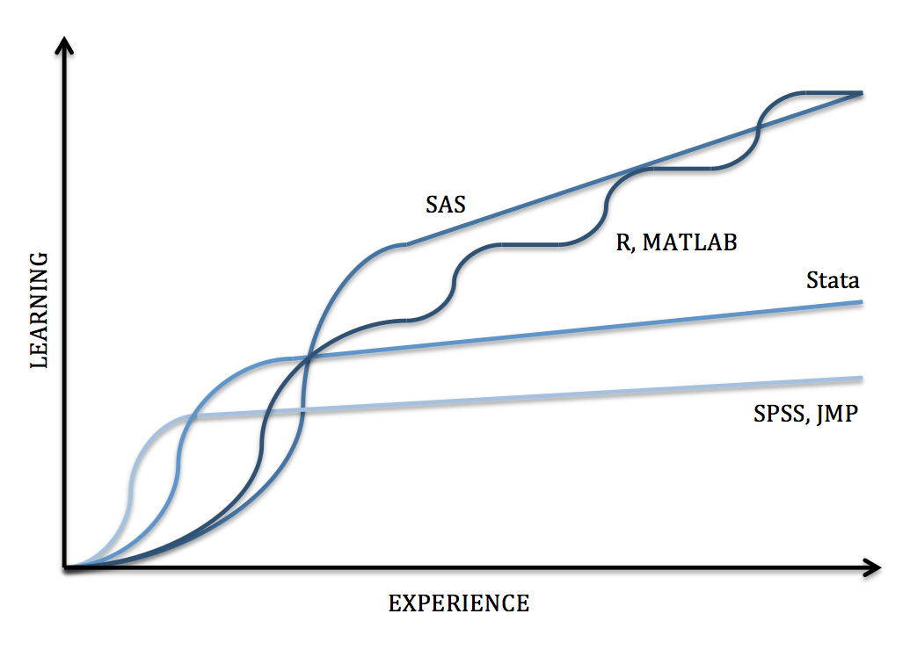
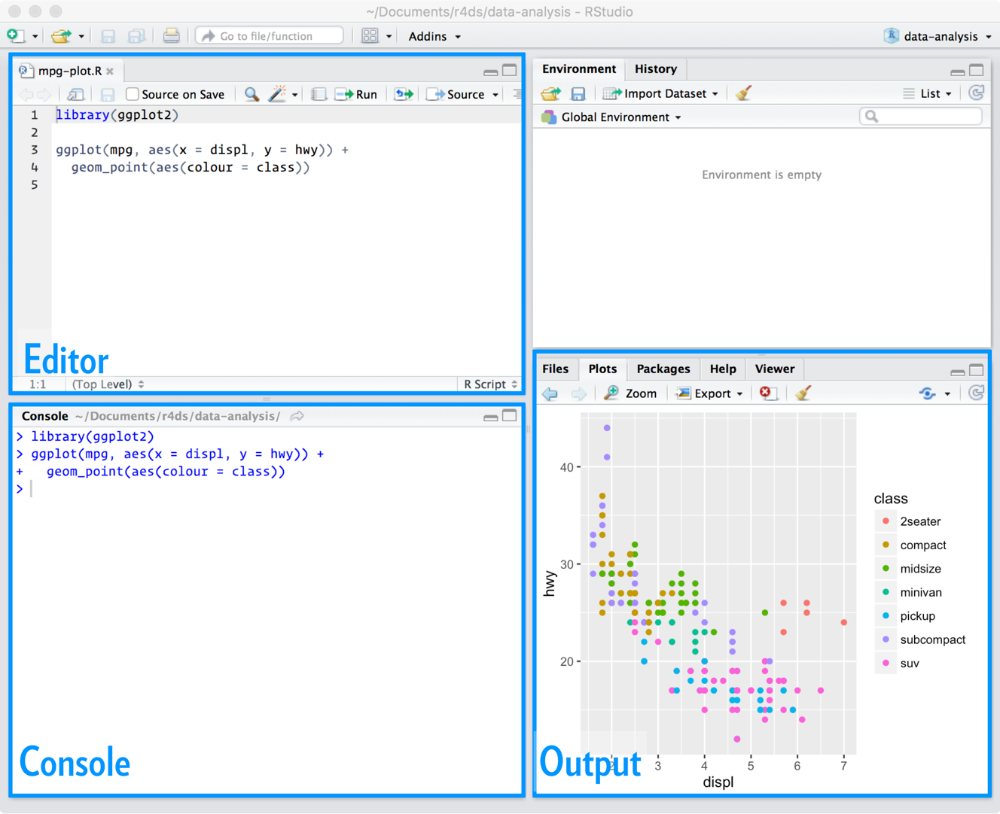
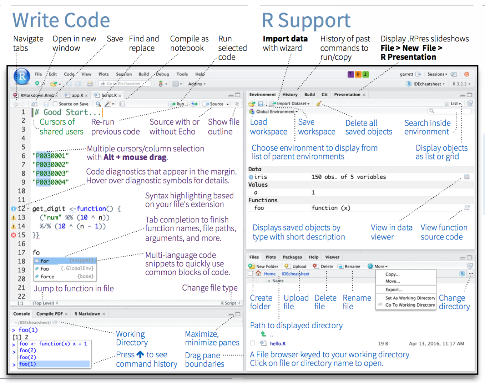
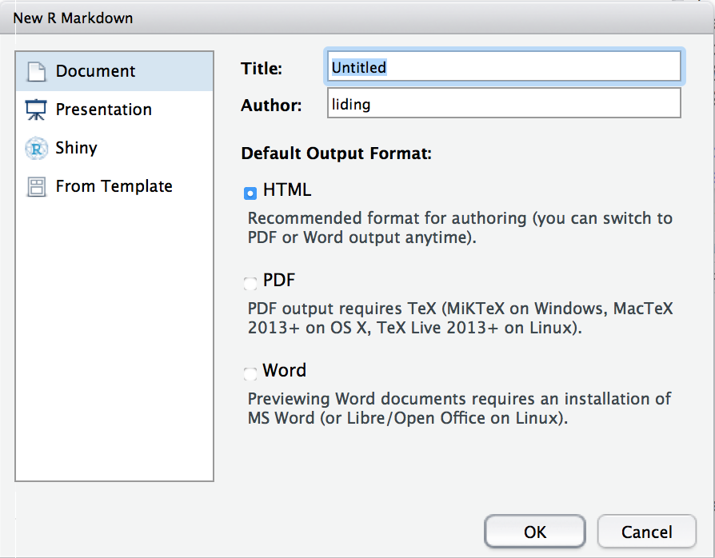
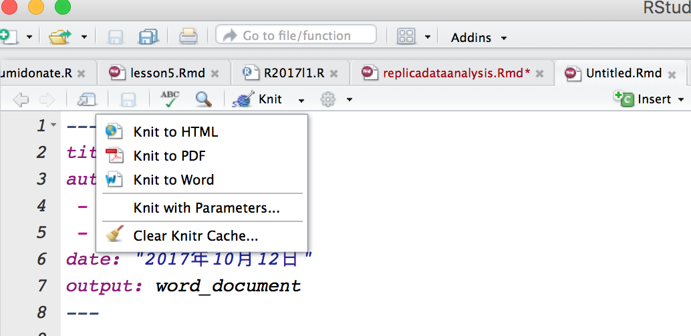
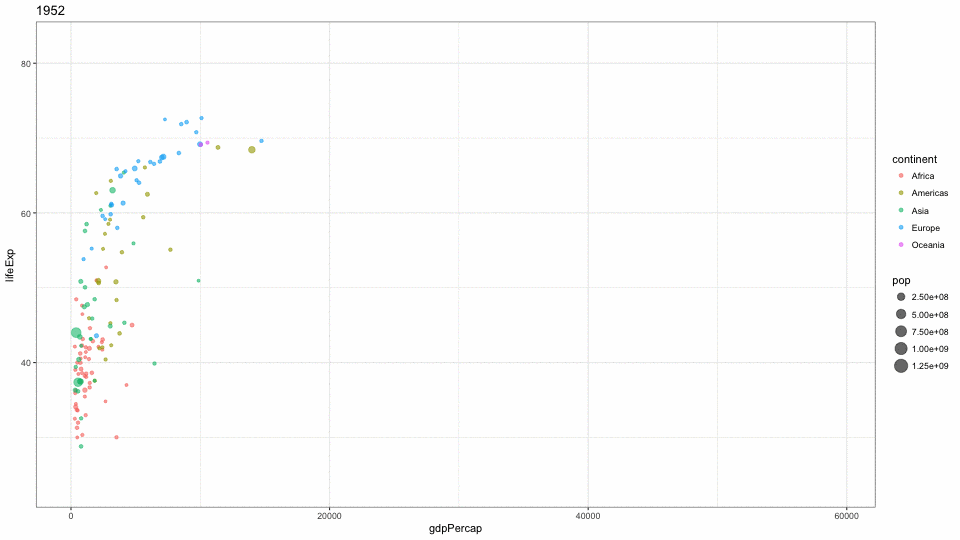
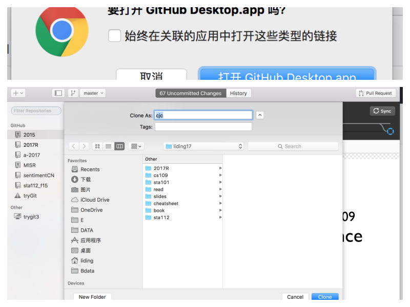
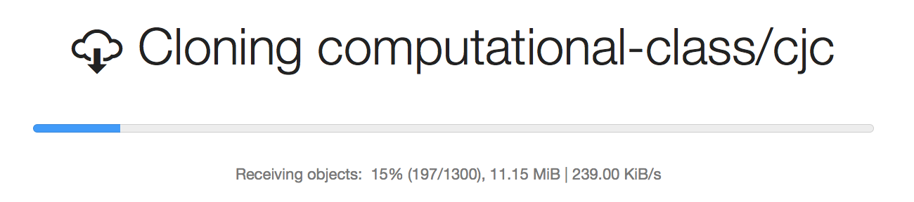
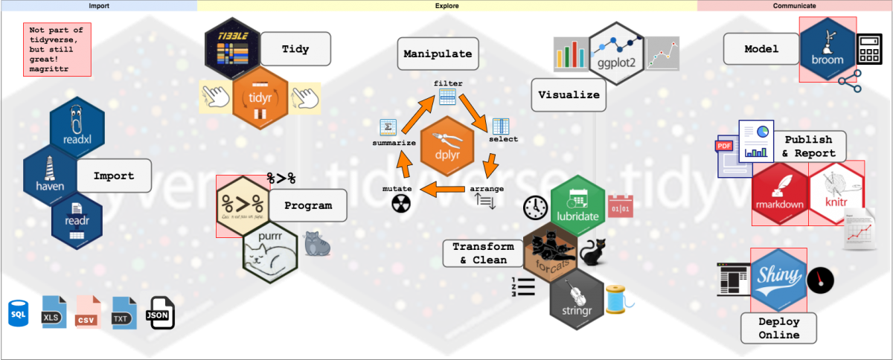

---
title: "R语言介绍及基础操作"
author: "李丁"
date: "2018年3月13日"
output:
  ioslides_presentation:
    widescreen: yes
    css: ../lec.css

---

## 课程大纲 

* R语言的特征(跳过)
* R使用流程与工具箱
* 演示:基础操作与数据分析流程
* 使用github获得最新讲义
* R入门方式与资料


# R 语言的特征

## 什么是 R

- R 语言是一种计算机高级语言，用于数据分析和绘图
  - 各种统计建模、作图；任意扩展
- R 语言脱胎于 1980 年左右诞生的 S 语言
  - 作者是新西兰奥克兰大学统计系Ross Ihaka与Robert Gentleman
  - S语言是贝尔实验室统计研究部编制的一套完整的高级语言系统
  - 在1998年被美国计算机协会(ACM) 授予了“软件系统奖”
- 1997 年 R 语言正式成为 GNU 项目，核心代码由R Core Team 维护
- 2010年获得第一届“统计计算及图形奖”（美国统计协会）


## R 语言的特点

- 开源且扩展性强(各类前沿方法)
- 面向对象的程序语言(面向过程的语言stata、spss)
- 与其它软件的交互能力、可嵌入性强
- 完整的工作流，实现可重复性(Reproducible)分析
- 文档多元多样(需要适应)
- 适用于多操作系统的轻量化平台
- 比较流行[排名](http://redmonk.com/sogrady/2017/03/17/language-rankings-1-17/)


## R 的整合能力 

- 数据：可连接数据库，如Oracle、MySQL
- 运算：可调用C或Fortran函数进行底层运算；多核、并行计算；GPU计算
- 应用：可作为运算引擎嵌入JAVA开发的系统中(Rserve)
- 网络：R与web整合部署(Rook, shiny)


## R 可以做什么？ 

- 统计计算与绘图（学术界）
- 数据爬取
- 文本分析
- 空间分析
- 网络分析
- R主体资源[task views](http://mirrors.ustc.edu.cn/CRAN/web/views/)


devtools::install_github('tidyverse/rlang’)
devtools::install_github('thomasp85/tweenr')

## R 语言学习路径特征 {#myImageP50}

- 学习曲线比较陡
- 不用就忘了




# R的使用流程与工具箱

## 工具组合{#myImageP90}


## R与Rstudio的关系

```{r, echo=FALSE,out.width = "1000px"}
knitr::include_graphics("../pic/R&Rstudio.png")
```


## R与R包的关系{#myImageP90}


## R的界面{#myImageP70}


## RStudio的界面{#myImageP70}



## RStudio的界面介绍{#myImageP70}



## RStudio的界面设定{#myImageP50}


## R和Rstudio、Rmarkdown的进一步学习
Chester Ismay

[Getting used to R, RStudio, and R Markdown](https://bookdown.org/chesterismay/rbasics/)


# 演示时间<br> 基础设定、安装包、<br>交互编程、创建文件、打开文件

## 安装

- [R的官方网站](http://www.r-project.org)
- [RStudio](http://www.rstudio.com)
- 扩展包的安装和加载
    - `install.packages("tidyverse")`
    - `library(tidyverse)`
- 安装扩展包相当于将某个工具买回来了；加载相当于带在身上了。
    - 查看帮助 `library(help="tidyverse")`
    
  
## 一些默认设定

改变默认语言(建议设定为英文)

- (win)修改R安装目录下`etc\Rconsole`文件，`language = en`
- (linux)在用户主目录中增加文件`.Renviron`，`LANGUAGE=en`
- (Mac) 在终端中输入 defaults write org.R-project.R force.LANG en_US.UTF-8 即可

查询当前工作目录`getwd()`
改变默认工作目录 `setwd("D:/work")`

注意Mac与Windows电脑路径表达差异


# 演示时间<br>通过Rscript<br>进行数据分析与结果呈现

## 演示内容

* 创建和保存R代码
* 运行R代码中的命令的方式：ctrl+enter 或者点击run


## 打开文件为乱码的情况
通过菜单file->reopen with encoding,简体中文通常可尝试选择gb2312解决


# 演示时间<br>使用Rmarkdown<br>进行数据分析与结果呈现

## 创建Rmd文件：菜单操作 {#myImageP90}


## 创建Rmd文件：设定输出文件格式 {#myImageP70}


## Rmd文件的结果
自动生成的模板文件已经设定了头部yaml

简单的文本和代码以及相关操作说明。

通过cmd+op+I插入代码。


## R Markdown 简单语法

**简单的标记语法（记得带空格）**

  1. \#表示一级标题；##二级标题 ###三级标题
  1. -号或+号或*号  表示列表
  1. 数字加英文句号  表示数字列表
  1. []加() 链接
  1. \![]加()插入图片
  1. 前后两个*  表示加粗
  1. 前后一个*  表示斜体
  1. \>  表示引用
  1. 兼容html语法和CSS设定
  
**技巧：**可以将一个[语法手册](https://www.rstudio.com/resources/cheatsheets/)放在手边，随时参考 .

## Rmd 代码块参数设置

设定 | 效果
------------------|--------------------
*include=FALSE*  |代码可以执行，报告(html、word)中不出现代码和结果，但是运行的结果存在workspace中，可以直接调用
*echo = FALSE* | 执行代码，打印结果，但是不打印代码~即最终报告中出现的结果，没有代码
*evalue = FALSE* | 不执行代码，仅呈现
*message = FALSE* | 执行代码，打印代码，不打印结果
*warning = FALSE* | 执行代码，不打印出warning的信息
*fig.cap = "..."*| 输出图形结果时添加标题
*fig.width / fig.height* | 设定输出图大小

## Rmd文件的编译 {#myImageP90}
编辑完成之后可以通过Rstudio上的Knit按钮进行转码打印



# Rmarkdown示例<br>预期寿命与人均GDP关系

## 数据分析任务
呈现全球国家的预期寿命(life expectancy)和人均GDP(GDP per capita)之间的关系. Hans Rosling曾经做个一个[TED演讲](https://www.ted.com/talks/hans_rosling_shows_the_best_stats_you_ve_ever_seen#t-1174047)。


## 第一步: 创建文件并加载必要的包（packages）

- 下面将使用 `dplyr`包 (用于数据处理 data wrangling) 和
`ggplot2` (用于作图，visualization) .

- 首先要确保这些包都安装了（installed）.

- 在markdown中加载（Load）这些包:

```{r message=FALSE}
library(dplyr)
library(ggplot2)
```

## 第二步: 导入数据

```{r}
# gapminder <- read.csv("https://stat.duke.edu/~mc301/data/gapminder.csv")
# setwd("/Users/liding/E/Bdata/liding17/2017R/lesson3/")
gapminder <- read.csv("../data/gapminder.csv")
```

## 第三步: 筛选数据

- 以`gapminder` 数据集（dataset）开始

- 选择年份（year）变量等于2007的案例

- 将筛选出来的案例存到一个新的数据集`gap07`

```{r}
gap07 <- gapminder %>%
  filter(year == 2007)
```

## 第四步: 探索和可视化（Explore and visualize）

**任务:** 呈现 `gdpPercap` 与`lifeExp`之间的关系.

```{r, fig.height=4, fig.width=7}
qplot(x = gdpPercap, y = lifeExp, data = gap07)
```

## 第五步: 深入分析1

**任务:** 各个大陆的点使用不同的颜色.

```{r, fig.height=4, fig.width=7}
qplot(x = gdpPercap, y = lifeExp, color = continent, data = gap07)
```

## 第五步: 深入分析2

**任务:** 在设定点的大小与人口规模成正比.

```{r, fig.height=4, fig.width=7}
qplot(x = gdpPercap, y = lifeExp, color = continent, size = pop,data = gap07)
```

## 创建动态图的命令（已失效）
```{r eval= FALSE,message=FALSE}
#library(dplyr)
library(gganimate)
library(ggplot2)
library(readr)
#install.packages("farver")
#install.packages("tweenr")
# install.packages('devtools')
#devtools::install_github('thomasp85/gganimate')
# gapminder <- read_tsv("gapminderDataFiveYear.tsv")
gapminder <- read.csv("../data/gapminder.csv")
gapminder <- subset(gapminder,gdpPercap<60000)
gapminder_plot <- ggplot(gapminder) +
  aes(x = gdpPercap, y = lifeExp, colour = continent, size = pop,
      frame = year) +
  geom_point(alpha = 0.6) +
  theme(aspect.ratio=9/16) +theme_bw()
gganimate(gapminder_plot, 
          convert='gm convert',ani.width = 960, ani.height = 540,interval=1.5,
          filename = "../pic/gapminder-gganimate.gif")

```

## 创建动态图的命令2
```{r}
library(gapminder)
library(gganimate)
ggplot(gapminder, aes(gdpPercap, lifeExp, size = pop, colour = country)) +
  geom_point(alpha = 0.7, show.legend = FALSE) +
  scale_colour_manual(values = country_colors) +
  scale_size(range = c(2, 12)) +
  scale_x_log10() +
  facet_wrap(~continent) +
  # Here comes the gganimate specific bits
  labs(title = 'Year: {frame_time}', x = 'GDP per capita', y = 'life expectancy') +
  transition_time(year) +
  ease_aes('linear')
```

## 动态图结果 {#myImageP80}


```{r, eval= FALSE,echo=FALSE}

```

# Github客户端的使用


## 注册和安装客户端
- 首先，注册GitHub账户并登陆 https://github.com/
- 其次，下载Github桌面版 https://desktop.github.com

选择windows或者mac版本。


## 克隆一个版本库{#myImageP90}

登录之后


## 克隆一个版本库{#myImageP70}




## 克隆一个版本库{#myImageP70}




## 更新版本库{#myImageP70}

将更新的讲义复制粘贴到另外的文件夹，添加笔记，进行修改。

不直接改动复制下来的文件夹。下次点击更新即可获得最新的讲义。

大家也可以创建自己的版本库，将自己更改后的讲义分享到github上。


# R入门方法与资料

## 学习 R 的方法

- 适时做笔记,记下一些重点或技巧（在原文件中加入批注的形式）。
- 学习时亲手键入代码，修改，理解其意义。
- 坚持练习,尝试利用身边的数据进行应用分析。

##本课程侧重教tidyerse

- 管道操作符 `%>%` 是Stefan Milton Bache and Hadley Wickham在`magrittr`中首创的.

- 将上一段命令的结果作为下一行命令的首个默认输入元素，从而可以：

    + 可以节省大量的代码
    + 代码可读性大大提高
    + 解释中间存储的对象，让工作空间更简洁
    + 已经做了大量的优化

- [David Robinson的解释为什么要像R的初学者教授tidyverse](http://varianceexplained.org/r/teach-tidyverse/)

- [lynda上的视频解释](https://www.lynda.com/R-tutorials/Why-use-tidyverse/586672/648975-4.html)

- [其他解释](https://www.r-bloggers.com/what-is-the-tidyverse/)


## 为什么教tidyverse{#myImageP90}

- 教学中会对照tidyverse与R基础语言，但以tidyverse为主，方便上手。
- 现在已经由Rstudio维护:质量、一致性、可持续性、扩展性有保证！



## 为什么教tidyverse

功能主题 |  基础命令 | tidyverse
----------|-------------|-------------
字符处理| 基础函数|stringr
绘图系统| plot|ggplot2
代码风格| 函数嵌套|管道函数（`%>%`）
列表处理| list（自建循环）|rlist
json处理| Rjson+RJSONIO|jsonlite
数据抓取| RCurl+XML|httr+xml2
循环任务| for/while——apply|plyr::a_ply——并行运算（foreach、parallel）
切片索引| subset|dplyr::select+filter
聚合运算| aggregate|plyr::ddply+mutate——dplyr::group_by+summarize
数据联结| merge——plyr::join|dplyr::left/right/inner/outer_join
数据塑型| plyr::melt/dcast|tidyr::gather/spread

## 为什么教tidyverse

功能主题 |  基础命令 | tidyverse
----------|-------------|-------------
聚合运算| aggregate|plyr::ddply+mutate——dplyr::group_by+summarize
数据联结| merge——plyr::join|dplyr::left/right/inner/outer_join
数据塑型| plyr::melt/dcast|tidyr::gather/spread

data.table 等高效包后面自学很快！

## 如何得到帮助
命令   |  功能
---------|------------------
 `help.start()` |  打开帮助文档首页
 `help("foo")`或`?foo` | 查看函数foo的帮助（引号可以省略）
 `help.search("foo")`或`??foo` | 	以foo为关键词搜索本地帮助文档
 `example("foo")` | 	函数foo的使用示例（引号可以省略）
 `RSiteSearch("foo")` | 	以foo为关键词搜索在线文档和邮件列表存档
 `apropos("foo", mode="function")` | 列出名称中含有foo的所有可用函
 `data()` | 	列出当前已加载包中所含的所有可用示例数据集
 `vignette()` | 	列出当前已安装包中所有可用的vignette文档
 `vignette("foo")` | 为主题foo显示指定的vignette文档

## 参考资料

+ 教材
    - 《R语言实战》
    - [《R for Data Science》]( http://r4ds.had.co.nz/)
    - [《 An Introduction to Statistical and Data Sciences via R》](http://moderndive.com/)
    - [《R for Data Science》习题答案](https://jrnold.github.io/e4qf/)

+ 其他资料

- tidydata简介: http://www.jstatsoft.org/v59/i10/paper

- tidyverse的学习网址:https://www.tidyverse.org/learn/

- Rmarkdown撰写的书籍:https://bookdown.org/home/


##  R基础语法练习

- 陈堰平4小时视频：http://www.xueqing.tv/course/64
- 纽约大学R基础入门:https://guides.nyu.edu/r
- 斯坦福R基础入门:https://sejdemyr.github.io/r-tutorials/statistics/
- 尤达学院探索性数据分析入门课程（推荐）：https://classroom.udacity.com/courses/ud651

##  交互测试练习网页
- 初级课程 : https://www.datacamp.com/courses/free-introduction-to-r
    + [1](https://campus.datacamp.com/courses/free-introduction-to-r/chapter-1-intro-to-basics-1?ex=1)
    + [2](https://campus.datacamp.com/courses/free-introduction-to-r/chapter-2-vectors-2?ex=1)
    + [4](https://campus.datacamp.com/courses/free-introduction-to-r/chapter-4-factors-4?ex=1)
    + [5](https://campus.datacamp.com/courses/free-introduction-to-r/chapter-5-data-frames?ex=1)
- 中级课程: https://www.datacamp.com/courses/intermediate-r
    + [1](https://campus.datacamp.com/courses/intermediate-r/chapter-1-conditionals-and-control-flow?ex=1)
    + [3](https://campus.datacamp.com/courses/intermediate-r/chapter-3-functions?ex=1)

## 时间允许 

[Data visualisation](file:///Users/liding/E/Bdata/liding17/book/r4ds/_book/data-visualisation.html)示例章的概要展示和作业说明

