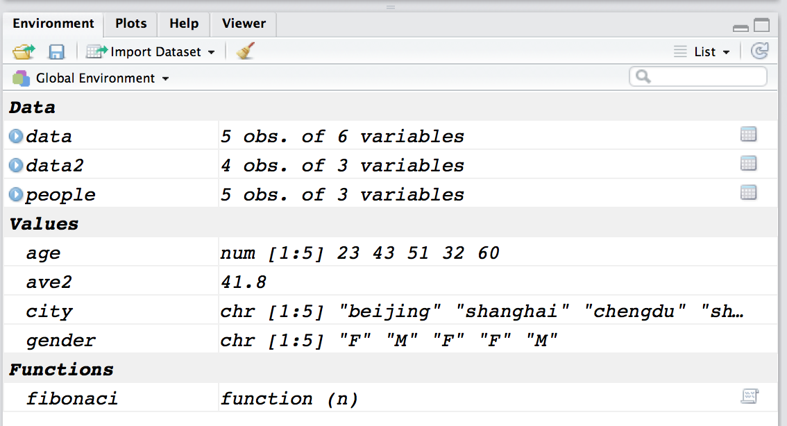

## R语言基础 

* 数据框与变量操作
* R中其他数据对象
* 基础统计
* R条件语句与循环


# 从数据框到R工作环境

    
## 数据框与变量处理
    - 数据框导入与创建
    - 数据的索引
    - 数据排序与类型
    - 创建和修改变量
    
## 数据框:导入
用过Excel、SPSS、stata应知道数据（data）是一种矩阵。列表示变量，行表示案例。各列类型可以不同但长度通常一致。在R中，我们称之为数据框(Data frame)。

```{r}
data <- read.csv("../data/people.csv")
knitr::kable(data)
```

## 数据框：构建数据框

```{r}
# 构建向量：注意三个一样长
city  <- c('beijing','shanghai','chengdu','shanghai','beijing')
age <- c(23,43,51,32,60)
gender <- c('F','M','F','F','M')

#合成数据框：3个变量
people <- data.frame(city,age,gender)
print(people)
```

## 数据框
探索基本属性
```{r}
summary(people)
dim(people)
class(people)
```
summary函数负责对每列进行统计，dim得到维度信息。

## 数据框：基本属性
```{r}
head(people,2) 
str(people)
```
head默认得到前六行数据，而str返回整个数据的结构。

## 数据框：变量名
```{r}
names(data)
# 更改变量名
names(data)[1:2] <- c("bigcity", "age2")
data$bigcity
names(data)[1:2] <- c("city", "age")
names(data)[1:2]
```


## 数据框：筛选部分变量

用`$`符号或者`[ ]`来提取部分变量

```{r}
people[2]   # 等价于 people[, 'age']
people[,2]   # 等价于 people[, 'age'] 或者 people$age
people[,2:3] # 等价于 people[, c('age','gender')]
```

## 数据框:筛选部分案例
```{r}
people[1:2,] # 头两行
people$age>30 # 判断每个age是否大于30
which(people$age>30 & people$age<50)  # 返回age大于30且小于50的位序号（indices of rows）
people[people$age>30,] # age大于30的行
```

## 数据框:筛选部分数据

```{r}
people$city[people$age>30] # age大于30,的city
people[people$age>30,-1] # 除第一个变量
# subset函数
data2 <- subset(data, age > 30, select = c("city","age","gender"))
data2
```

## 数据框：变量排序（Reordering the columns）
这种操作通常没什么实质意义。更多变量情况下可以自定义函数，请参考[网页](https://stackoverflow.com/questions/12544888/is-there-an-equivalent-r-function-to-stata-order-command#)
```{r}
data[c(1,3,2)]
data <- data[c(1,3,2)]  # 保存更新
# data[c("city", "gender", "age")]# 用变量名
data[, c(1,3,2)] # 这样也可以
```


## 数据框：案例排序（Sort cases）
```{r}
sort(data$age)    #  sort() only works for vectors,其他变量没动
order(data$age)
data[order(data$age),] # 按age排序
# data[order(data$gender),] # 按gender排序
```

## 数据框：案例排序（Sort cases）
```{r}
data[order(data$age,decreasing=T),][1:2, ] # 按age降序，头两个案例
data <- data[order(data$city,-data$age),] # city升序，age降序
data
```

## 数据框：变量类型

变量测量层次四种类型：

测量类型    | SPSS         |   R 
------------|--------------|--------------
分类        | categorical  |   factor
定序        |	ordinal      |   factor with order
定距        | scale        |   int、num
定比        |	scale        |   int、num


从数据类型分为：整数、实数、复数、字符、日期、因子、逻辑、缺失值、原始数据raw

## 数据框：更改变量类型

```{r}
str(people) # 数值、因子
# data.frame函数默认将字符变为因子变量，可以设定。
data <- data.frame(city,age,gender,stringsAsFactors=F)
data$gender <- as.factor(data$gender)
str(data) # 字符、数字、因子
```

## 数据框：对象类型转换

+ as.numeric()    变为数字
+ as.character()  变为字符 
+ as.vector()     变为向量
+ as.matrix()     变为矩阵
+ as.data.frame() 变为数据框
+ as.factor()     变成因子


## 创建变量
```{r}
data$base <- 1
data$age + data$base  # 等价于 data$age+1
#或者
data$age2 <- rowSums(data[,c(2,4)])
#或者
apply(data[, c(2,4)], 1, sum) 
# 删除变量
data$base <- NULL
```

## recode变量

```{r}
data$age 			
data$age_cat[data$age <= 30] <-"Group 1"
data$age_cat[data$age > 30 & data$age <= 50] <- "Group 2"
data$age_cat[data$age > 50] <-"Group 3"
data
```

## 数据框：recode变量

可以使用包中的命令
```{r, eval=FALSE}
install.packages("car")
library(car)
data$age_cat<- car::recode(data$age, "1:30=1;30:50=2;50:80=3")
```

## 数据框：创建变量

数据框将不同向量组合一起,方便对每一个案例进行统一的操作。如果放在不同的向量中，由于缺失、筛选等原因造成长短不同，容易出现问题。
尝试找出高于平均温度的城市。
```{r}

data$ave <- mean(data$age) # ave 变为data内的一个变量
data[data$age>data$ave,]

```

## 数据框：创建变量
```{r}
ave2 <- mean(data$age) # 注意 ave2为 data之外的东西 
data[data$age>ave2, ] # 年龄超过平均年龄的案例
(data <- cbind(data,ave2)) # data <- cbind(data,ave2) 
data$ave2 <- NULL  # 删除ave2变量
```

## 工作环境{#myImageP70}

上面的data、data2、people、city、age、gender、ave2所处的空间叫工作空间
```{r}
ls()
```


## 工作环境

- `ls()`  列出当前工作环境中的对象
- `rm(objectlist)`  移除（删除）对象,如 rm(age, city, gender)
- `save.image("myfile")`	保存工作环境到文件myfile中（默认后缀 .RData）
- `save(object, file="myfile")`	保存指定对象到一个文件中
- `load("myfile")`读取一个工作环境到当前会话中
- `attach(data)` 将data中的变量直接挪到工作环境中

```{r}
attach(data) # 注意工作环境中已经有了
detach(data) # 
rm(data2, ave2)  # 从工作环境中移除data2
# rm(list=ls()) # 删除所有
```

## 工作目录

这是R默认读取和操作的磁盘文件夹路径，作为一个变量暂存在了工作环境中

- `getwd()`  显示当前的工作目录
- `setwd()`  修改当前的工作目录


# R中的其他对象


## 对象:类型
所有东西都是一个对象：Everything in S(R) is an object;

所有对象都属某种类型：Every object is S(R) has a class.

* 向量
* 矩阵
* __数据框__
* 数组
* 列表


## 对象：向量

- 单个数值（标量）,是向量的一种特例
- 向量的元素必须属于某种模式（mode）:可以整型（integer）、数值型（numeric）、字符型（character）、逻辑型（logical）、复数型（complex）
- 循环补齐（recycle）：在一定情况下自动延长向量
- 筛选：提取向量子集
- 向量化：对向量的每一个元素应用函数
- 使用seq()创建向量
- 使用rep()重复向量常数
```{r eval=FALSE}
vector1 <- seq(2,10,2)
vector1 <- 1:10 + 2
vector2 <- 1:(10 + 2)
```


## 向量：赋值与索引
R语言中可以给向量、数据框、函数等指定一个“名字“。或则说，给名字对应的**变量**赋值。赋值操作符为等号“`=`”，也可以是"`<-`"。
```{r}
x <- c(1,2,3,4)
log(x)
```
使用方括号索引一个向量：
```{r eval=FALSE}
x[2] # 第二个元素
x[2:4] # 第2到4个元素
x[-4] # 减去第4个元素后
x[x>2] # 大于2的元素
```

## 向量:向量化操作

R中没有专门的标量。向量化操作是R的基本特征：

```{r eval=FALSE}
nchar(c("hello world", "I am a R user"))
c(1,2,3,4) + c(3,4,5,6)
c(1,2,3,4) + c(1,2)
1:6
seq(0,1,by=0.1)
```

向量之间除了四种数字运算外，还可以进行比较，例如：
```{r}
c(1,2,3,4) > c(1,2,1,2)
```


##  向量的计算
去掉最大值和最小值后的向量的算术均值
```{r}
vector <- rnorm(10)
vec_max <- max(vector)
vec_min <- min(vector)
vector_trimmed <- vector[vector<vec_max & vector>vec_min]
vec_mean <- sum(vector_trimmed)/length(vector_trimmed)

```


## 算术运算小结

- `x + y`     加法
- `x - y`     减法
- `x * y`     乘法
- `x / y`     除法
- `x ^ y`     乘幂
- `x %% y`    模运算(求余数)
- `x %/% y`   整数除法()


## 函数:
上面的基本运算符号还可以作为函数使用。R中还有很多函数来建立对应关系，大多数的函数由函数名和参数组成的。`exp`是函数名，括号中的1则是参数。又可以分为三部分构成，即输入、运算、输出。
```{r}
`*`(3,4)
exp(1)
exp(c(1,2,3,4))
```

## 自定义函数

我们还可以自定义函数，如求圆面积的函数
```{r}
myfunc <- function(r) {
  area <- pi*r^2
  return(area)
  }
print(myfunc(4))
```
函数在调用时会新建一个特殊子环境，用以处理函数中涉及到的变量，例如上面函数中的area变量，这种变量称为__局部变量__。因为不会在全局环境中出现而影响其它函数，使用起来非常安全。

函数内部可以调用__全局变量__，例如上面的pi。


## 矩阵

```{r}
vector1 <- vector2 <- vector3 <- rnorm(3) # rnorm(n, mean = 0, sd = 1)
my_matrix <- cbind(vector1,vector2,vector3)
my_matrix 
ifelse(my_matrix>0,1,0)
```

## 矩阵

```{r}
vector <- 1:12
dim(vector) <- c(4,3)
print(vector)

vector4 <- rnorm(8)
vector4
matrix(vector4,nrow=2,ncol = 4, byrow = FALSE)
```

## 矩阵运算

```{r}
A <- matrix(c(3,1,5,2),2,2)
b <- matrix(c(4,1),ncol=1)
x <- solve(A,b)
```


## 数组
数组(Array)是多维的向量，建立数组的方法如下：
```{r}
a <- array(1:12,dim=c(2,3,2))
print(a)

```
```{r eval=FALSE}
a[2,2,2]
a[2,1,1]
a[2,1,]  # 不能丢掉最后一个逗号，维数要一致
dim(a)
```

## 列表
列表(List)是最为灵活的数据结构.它的元素可以是不同类型，也可以有不同长度。还是用age、city、gender三个向量来构建列表。
```{r}
data_list = list(age=age,city=city,gender=gender)
class(data_list)
print(data_list)
```
```{r}
data_list$mat <- my_matrix # 矩阵
data_list$data <- data # + 数据
```


## 列表
列表也能使用数字来索引，但需要用两个方括号。例如提取最后一个data元素。

```{r}
names(data_list)
data_list$data
length(data_list)
data_list[[4]]
```


## 列表内部结构
函数`str()`可用以查看一个对象的内部结构。
```{r}
str(data_list)
```

# 基础统计
## 基础统计:导入数据
```{r}
if(!require(car)) install.packages("car")
# data(package="car")
# ?Mroz
data(Mroz)
head(Mroz)
summary(Mroz)
```


## 基础统计:连续变量
```{r}
mean(Mroz$inc, na.rm = TRUE)
median(Mroz$inc, na.rm = TRUE)
sd(Mroz$inc, na.rm = TRUE)
quantile(Mroz$inc, na.rm = TRUE)
```
## 基础统计:分类变量

```{r}
table(Mroz$wc)
prop.table(table(Mroz$wc))
table(Mroz$wc, Mroz$hc)
```
## 基础统计:分类变量
```{r}
# 行列边缘分布
margin.table(table(Mroz$wc, Mroz$hc), 1)
margin.table(table(Mroz$wc, Mroz$hc), 2)

# 行列百分比
prop.table(margin.table(table(Mroz$wc, Mroz$hc), 1))
prop.table(margin.table(table(Mroz$wc, Mroz$hc), 2))
```
## 基础统计:相关

```{r}
cor(Mroz[7:8])
plot(Mroz[7:8])

```
## 基础统计:相关
```{r}
boxplot(lwg ~ wc, ylab = "log expected wage rate", xlab = "college attendance", 
        data = Mroz)  
```

## 基础统计:模型

模型是描述数据的函数。很多时候以公式形式展现，用以预测或解释。
```
y ~ x1 + x2 + x3 ... + xn
```
一个线性回归例子：使用的数据集是R内置数据car。R语言中回归分析的函数是`lm`，将回归结果存入变量`model`中。

```{r}
model <- lm(formula=lwg ~ age + k5 + k618 + wc + hc +inc , data=Mroz)
# str(model)
```

##  泛函数

`summary`作为一个泛函数，可呈现回归结果：包括了各系数及其对应的P值，残差标准误和决定系数等。

```{r}
summary(model)
```


## 缺失值

真实的数据分析工作中会经常遇到数据缺失情况，缺失的数据在Ｒ中一般表示为NA。当一个数据中包含了NA时，很多函数的行为会不一样，甚至会产生错误。
```{r}
age <- c(27, 29, 23, 14,NA)
mean(age)
mean(age,na.rm=T)
is.na(age)
table(is.na(age))
```

## 空值
缺失值的意义是应该有数据而没有，起到一个占位符的作用。空值的意义则是完成没有，空值的表示是NULL。下面的例子中age仍然只有四个元素。
```{r}
age <- c(27, 29, 23, 14,NULL)
```
NULL有时候可以用来方便的删除复杂对象中的一个元素，例如删除前面data_list中的data元素。
```{r eval=FALSE}
data_list$data <- NULL
```

##  数据写出
```{r}
write.csv(people, "data.csv", row.names = FALSE) 
```

用readr包

write_csv(data, 'data.csv')

用 haven 包导出 SPSS or Stata 文件

write_spss(data, "my_spss.sav")

write_dta(data, "my_stata.dta")


# 条件语句与循环

## 条件判断

通常R代码的执行是按行顺序执行的，但有时需要根据条件来执行某些分支代码
```{r}
num <- 5
if (num %% 2 != 0) {
  cat(num,'is odd')
}
```


## 逻辑比较
operator    | definition
------------|--------------------------
`<`         | 小于
`<=`        |	小于等于
`>`         | 大于
`>=`        |	大于等于
`==`        |	等于
`!=`        |	不等于
`x | y`     | `x` 或 `y`
`x & y`     | `x` 和 `y`


##  逻辑比较 

operator     | definition
-------------|--------------------------
`is.na(x)`   | 检查 `x` 为 `NA`
`!is.na(x)`  | 检查 `x` 不是 `NA`
`x %in% y`   | 检查 `x` 包含于 `y`
`!(x %in% y)`| 检查 `x` 不包含于 `y`
`!x`         | 非 `x`

- 逻辑值`TRUE`和`FALSE`可以缩写为`T`和`F`（两者都必须是大写）。而在算术表达式它们会转换为1和0
- 判断两个实数相等最好用identical(x,y)。 
## 条件判断：if
if只是单一判断是否执行某条代码，若需要多分支判断，可增加else语句，例如增加奇数和偶数的屏幕输出。
```{r}
num <- 4
if (num %% 2 != 0) {
  cat(num, 'is odd')
} else {
  cat(num, 'is even')
}
```


## 条件判断：if - else if
对于超过两个分支的条件判断，我们可以使用多重嵌套的if-else语句。例如计算某个数字和3相除的余数。
```{r}
num <- 10
if (num %% 3 == 1)  {
  cat('mode is',1)
} else if (num %% 3 == 2) {
  cat('mode is',2)
} else {
  cat('mode is',0)
}
```


## 二元判断函数：ifelse

ifelse可用于向量化计算，例如判断多个数字是奇数还是偶数。
```{r}
num <- 1:6
ifelse(num%%2==0, yes='even',no='odd')
```
ifelse的嵌套
```{r}
num <- sample(20:70,20,replace=T)
res <- ifelse(num>50,'老年',ifelse(num<30,'青年', '中年'))
```


## 循环：for

循环语句可以重复运行某一段代码。根据终止的条件，可以将循环分为for循环和while循环。

for循环的终止条件是循环的次数，例如我们计算1到100所有奇数的和。

```{r}
x <- 0
for (i in 1:100) {
  if (i %% 2 != 0) {
    x <- x + i
  }
}
```

实际，计算奇数之和只需要一条代码即可。

```{r eval=FALSE}
sum(seq(1,100,by=2))
```


## 循环：while

while循环的终止条件是达到某一个标准，还是计算上面同样的例子。

```{r}
x <- 0
i <- 1
while (i < 100) {
  if (i %% 2 != 0) {
    x <- x + i
  }
  i <- i + 1
}
```


## 循环：repeat

用repeat来进行无限次的循环操作，仍是计算100以内的奇数之和。


```{r}
x <- 0
i <- 1
repeat  {
  if (i %% 2 != 0) {
    x <- x + i
  }
  i <- i + 1
  if (i > 100) break
}
```


## 循环：next
跳过循环中next后面的代码，而重新开始一次循环。

```{r}
x <- 0
i <- 0
repeat  {
  i <- i + 1
  if (i > 100) break
  if (i %% 2 == 0) next
  x <- x + i
}
```


## 循环与函数综合示例

编写自定义函数是非常容易的。计算fibonaci数字的函数：

斐波纳契数列：F(0)=0，F(1)=1, F(n)=F(n-1)+F(n-2)（n>=2，n∈N*）。这个数列从第3项开始，每一项都等于前两项之和。

```{r}
fibonaci <- function(n) {
  i <- 2
  x <- 1:2
  while (x[i] < n) {
    x[i+1] <- x[i-1] + x[i]
    i <- i + 1
  }
  x <- x[-i]
  return(x)
}
SeqFi <- fibonaci(100)
```

## 课后自学强化
《R语言实战》第一部分、第二部分。

把书读薄：[R语言基础小抄](http://github.com/rstudio/cheatsheets/raw/master/base-r.pdf)，并将相关的代码输入到R代码文件中。

[更多小抄](https://www.rstudio.com/resources/cheatsheets/)

