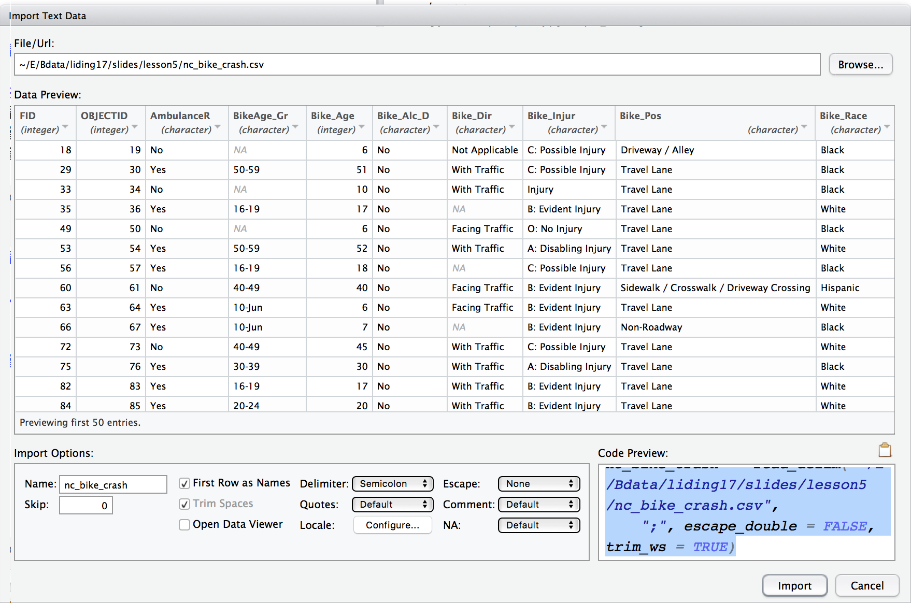
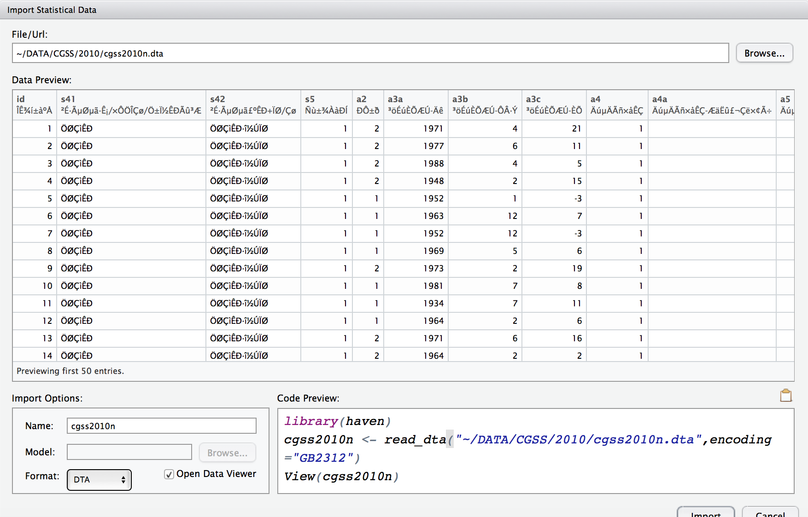
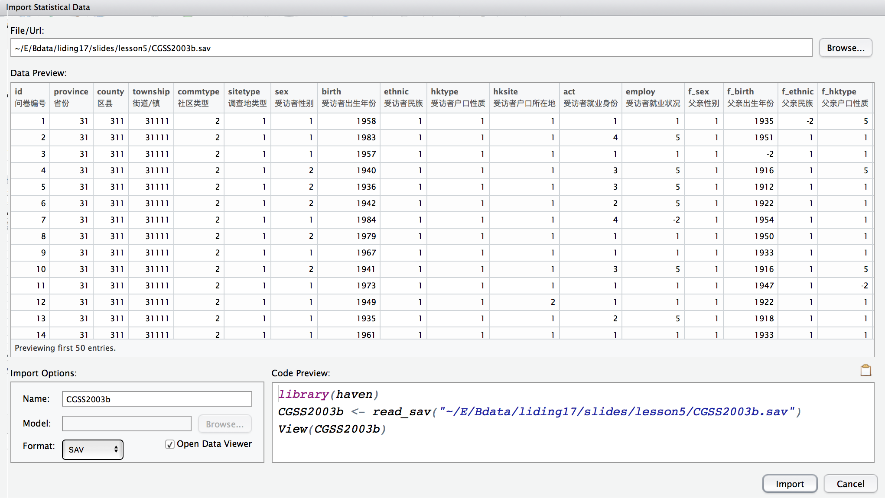

## 内容提纲

- 数据导入 Data import
    + csv数据
    + SPSS数据
    + stata数据
    + sas数据
    
- 数据整理 Tidy data
    + 理想的数据结构
    + 宽数据变长数据:gather
    + 长数据变宽数据:spread
    + 数据的合并:merge & join
    
- 变量管理(待续) 

# 数据读入

## R读入文本文件
使用tidyverse中的readr包：
```{r, message=FALSE}
library(tidyverse)
```

```{r,eval = FALSE}
library(readr)
dataset <- read_csv(文件路径和文件名)
```
- read_csv()  读入csv文件,
- read_csv2() 读入封号分割文件
- read_tsv()  读入制表符分割文件 
- read_delim() 读入各种固定分隔符文件.
- read_fwf()  读入固定宽度文件；用 fwf_widths() or fwf_positions()设定栏位 
- read_table() 读入空格分割的固定宽度文件
- read_log() 读入Apache风格的log文件。更复可参考`webreadr` 。

## R读入固定分隔文件{#myImagePage2}
使用菜单：

<div style="float: left;width: 30%;text-align: left;">

</div>

<div style="float: right;width: 70%;text-align: right;">

</div>


## R读入固定分割文件
Rstudio推荐的是用readr包，自动变为tbl文件。
读入一个北卡罗来纳州的自行车交通事故相关的数据。
```{r,message= FALSE,warning=FALSE}
library(readr)
bike <- read_delim("nc_bike_crash.csv", ";", 
    escape_double = FALSE, trim_ws = TRUE)
```
```{r}
class(bike)
```

下载数据 https://stat.duke.edu/~mc301/data/nc_bike_crash.csv

更多信息 https://stat.duke.edu/~mc301/data/nc_bike_crash.html.

[原始网站](https://opendurham.nc.gov/explore/dataset/north_carolina_bicycle_crash_data_heatmap_/table/)

## R读入固定分割文件
使用utils包中的read.table和read.csv命令，进一步变为tbl文件
```{r, eval=FALSE}
bike <- read.csv("nc_bike_crash.csv", 
                 sep = ";", 
                 stringsAsFactors = FALSE) %>%
       tbl_df() 
class(bike)
```

## 查看数据及其属性
命令格式：
```{r,eval =FALSE}
View(data)
class(data)
str(data)
head(data)
dim(data)
names(data)
```

例如：
```{r}
dim(bike)
str(bike)
```


## 读入SPSS、stata或SAS数据
Rstudio推荐使用haven包读入数据
```{r,eval= FALSE}
library(haven)
data1 <- read_sav("路径+文件名.sav")
data2 <- read_stata("路径+文件名.dta",encoding ="GB2312")
data3 <- read_sas("路径+文件名.sas7bdat")
```

<br>
haven包读入数据后，变量和取值标签变为变量的属性。

Stata14之前的数据无Encoding信息,中文数据可能是GB2312编码。

Stata14版本支持unicode编码。haven默认可以读入。

## 读入CGSS数据:Stata{#myImagePage}
当预览标签为乱码时，可尝试设定encoding=“GB2312”或者encoding=“gbk”。没有乱码的情况下，通常encoding为默认的utf-8,可以不设定。



```{r,eval = FALSE}
library(haven)
cgss2003 <- read_dta("cgss2003.dta",encoding = "utf-8")
```

## 读入CGSS数据:SPSS{#myImagePage2}
SPSS数据默认unicode编码,haven包的read_spss无法设定encoding信息。

 

## 读入CGSS数据:SPSS &Stata
haven包默认导入spss和stata数据后,变量标签的定义位于数据框每列字段的label属性当中,取值标签在labels属性当中。

```{r}
library(haven)
cgss2003 <- read_sav("CGSS2003b.sav")  # spss7.0版数据
str(cgss2003$sitetype)
attr(cgss2003$sitetype,"label")
attr(cgss2003$sitetype,"labels")
```

## 如何使用label信息？{#myImagePage2}

直接统计分析，输出中没有标签信息

<div style="float: left;width: 40%;text-align: left;">
```{r}
cgss2003 %>%  count(sitetype)
```
</div>

<div style="float: right;width: 60%;text-align: right;">
```{r}
ggplot(cgss2003, aes(x=sitetype)) +
  geom_bar() + 
  scale_x_discrete(drop=TRUE)
```
</div>


## 如何使用label信息:1-使用sjPlot包分析

```{r , warning = FALSE,message= FALSE}
#if(!require(sjmisc)) install.packages("sjmisc")
if(!require(sjPlot)) install.packages("sjPlot")
sjt.frq(cgss2003$sitetype)
```

## 如何使用label信息:1-使用sjPlot包分析
```{r,fig.height= 4}
sjp.setTheme(theme.font ='STXihei' ) # STHeiti也可
cgss2003  %>% select(sitetype) %>%  sjplot(fun="frq")
```

[更多介绍1](https://strengejacke.wordpress.com/2016/11/14/pipe-friendly-workflow-with-sjplot-sjmisc-and-sjstats-part-1-rstats-tidyverse/);[更多介绍2](https://strengejacke.wordpress.com/sjplot-r-package/);[MAC电脑Rstudio作图中文乱码的解决方案](http://note.youdao.com/noteshare?id=9367dbf7c91458d07f54e256b6c2271d)


## 如何使用label信息:2-转换为因子
使用haven包的as_factor()命令可以将所有labelled的列变成因子。
```{r,fig.height=2.5}
cgss2003  %>%
  filter(sitetype>0) %>%
  select(sitetype) %>% 
  haven::as_factor() %>% 
  droplevels() %>% 
  sjplot(fun="frq",axis.title="调查地类型")
```

## 如何使用label信息:2-转换为因子
用SJ[(strange jack)](http://www.strengejacke.de/sjPlot/)的`sjmisc::to_label()`可以将所有labbled的列转为因子。

可同时设定是否将标记的用户缺失值替换为NA(drop.na=TRUE)，是否删除未用到的取值标签(drop.levels=TRUE)。

```{r,fig.height=2.5}
cgss2003  %>%
  select(sitetype) %>% 
  sjmisc::to_label(drop.levels=TRUE) %>% 
  sjplot(fun="frq",axis.title="调查地类型")
```

## 如何使用label信息:2-删除因子
定义了用户缺失值标签的*连续变量*可使用zap_labels将缺失值标签删除。<br>sjlabelled中zap_labels可以批量删除标签，并将这些标签对应的取值替换为NA。<br>haven中的zap_labels可以删除所有标签，仅将用户定义缺失值替换为NA。

```{r,fig.height=2.5,message=FALSE}
cgss2003  %>%
  select(birth05) %>% 
  sjlabelled::zap_labels() %>% 
  qplot(binwidth=5)
```


## foreign包读入数据{#myImagePage}
除了haven包外，foreign包也是读入常见数据的较为成熟的包。例如，SPSS数据默认unicode编码,但CGSS2003.SAV数据仍存在乱码。一种方法是将其在spss中另存为低版本如SPSS7.0数据，然后用haven包的read_spss读入。

 

另一种方法是用foreign包中的read.spss函数读入。它可设定reencode参数。
```{r}
cgss <- foreign::read.spss("CGSS2003.sav",reencode = "GB2312",to.data.frame=TRUE)
```


## foreign包读入数据

foreign包读入外部数据时可选参数更多。`read.dta`,`read.spss`导入数据后,变量标签存在 variable.labels属性当中,<br>取值标签存在label.table属性中。默认将带标签的标量转化为 factor类型。如果有些取值没有label,会自动添加。

```{r,warning= FALSE}
attr(cgss, "variable.labels")[1:6]
str(cgss$sitetype)
```

## foreign读入数据:删除务必要的因子levels

```{r,warning=FALSE,fig.height=2.5}
cgss[cgss=="无填答/不回答"] <- NA
cgss[cgss=="不知道/说不清"] <- NA
cgss[cgss=="不适合"] <- NA
cgss[cgss=="不适用"] <- NA
cgss <- droplevels(cgss)
ggplot(data=cgss,aes(x=sitetype))+geom_bar() +theme(text=element_text(family="STKaiti"))
#SimSun、SimHei 、STHeiti、 STXihei 
```
中文字体名：http://www.cnblogs.com/code/articles/2381967.html

## R读入CGSS2003的完整例子1
```{r}
library(haven)
cgss2003 <- read_sav("CGSS2003b.sav") 
#cgss2003 <- foreign::read.spss("CGSS2003b.sav",use.value.labels=FALSE,to.data.frame = TRUE) # 不行
cgss2003[cgss2003==-1] <- NA;cgss2003[cgss2003==-2] <- NA;cgss2003[cgss2003==-3] <- NA
str(cgss2003$sitetype)
cgss2003 <- sjlabelled::drop_labels(cgss2003) #删除不必要的label
str(cgss2003$sitetype)
```

## R读入CGSS2003的完整例子2
```{r}
cgss2003 <- sjmisc::to_label(cgss2003) # label转为因子
knitr::kable(as.data.frame(table(cgss2003$sitetype)))

# 可以进一步将所有labelled变量转化为普通数值变量。
w <- which(sapply(cgss2003, class) == 'labelled')
cgss2003[w] <- lapply(cgss2003[w], 
                      function(x) as.numeric(as.character(x))
                      )
```


## 针对中文数据的改进
陈华珊自定义的ezdf包针对中文做了一些改进，将变量标签存在了meta数据框中,可分别设变量标签和文本变量的编码。其中定义了简单的汇总函数，可将取值标签自动添加到汇总统计中。
```{r,eval= FALSE}
# 安装必要的包，运行一次即可
install.packages('data.table')
library(devtools)
options(download.file.method = "wininet")
install_git("https://github.com/huashan/ezdf")
install_github('huashan/pander')

# 加载包
library(ezdf)
dat <- readStata(file,varNameEncoding="GB2312",charEncoding="GBK")
```

更多信息:https://github.com/huashan/ezdf/blob/master/Doc/Easy_Data.pdf


##  注意: Strings (characters) 和 factors的差异

- 默认情况R会将字符当做因子变量处理（统计渊源）
- 有时候会带来麻烦
- 使用 `stringsAsFactors = FALSE` 修改默认设定

+ 可以将其他数据导出为csv文件(注意编码)然后读入R 

# 数据整理

## Tidy data {#myImagePage2}

1. 每个变量构成一列
2. 每个案例构成一行
3. 每个取值都有自己的单元格
4. 每类观察对象自成一个表
<div class="columns-1">

</div>
## 比较下面几个数据

<div class="question">
下面哪种数据最好用？
</div>

<div class="columns-2">

```{r}
table1
```

<br><br><br><br>

```{r}
table2
```
</div>

## 比较下面几个数据

<div class="columns-2">

```{r}
table3
```

<br><br><br><br>

```{r}
table4a
table4b
```
</div>

##  使用示例：创建新变量

```{r}
table1 %>% 
  mutate(rate = cases / population * 10000)
```

## 使用示例：汇总
```{r}
table1 %>% 
  count(year, wt = cases)
```

## 使用示例：作图
```{r}
library(ggplot2)
ggplot(table1, aes(year, cases)) + 
  geom_line(aes(group = country), colour = "grey50") + 
  geom_point(aes(colour = country))
```

## 宽数据变长数据{#myImagePage2}


## 宽数据变长数据
使用`gather`命令

原变量名列表归为新变量key=,取值归入新变量value=

```{r}
table4a %>% 
  gather(`1999`, `2000`, key = "year", value = "cases")
```

## 宽数据变长数据
```{r}
table4b %>% 
  gather(`1999`, `2000`, key = "year", value = "population")
```

## 长数据变宽数据

```{r}
table2
```

##  长数据变宽数据
使用`spread`命令，变量名key来自什么，取值value来自于什么
```{r}
spread(table2, key = type, value = count)
```

## 长数据变宽数据{#myImagePage2}


## reshape 命令：Make a Panel Dataset
```{r}
# Make a Panel Dataset
health <- data.frame(id = rep(1:10, each = 4, len = 40),
                     trial = rep(c(1:4), 10), 
                     score = rnorm(40, 3, .75))
health[1:10, ]
```

## reshape 命令：Long --> Wide
```{r}
# Reshape : Long --> Wide
health_wide <- reshape(health, v.names = "score", idvar = "id", 
                       timevar = "trial", direction = "wide") 
health_wide[1:5, ]
head(reshape(health_wide)) # to go back to long format
```

## reshape 命令：Wide --> Long
```{r}
# Reshape : Wide --> Long
health_long <- reshape(health_wide, idvar = "id", direction = "long")         
health_long[1:15, ] 
```

## tidy方式：变宽(练习)
```{r,eval=FALSE}
spread(health, key = ?, value = ?) # key is the identifier
```

## tidy方式：变长(练习)
```{r,eval=FALSE}
# can also reference by column number(2:5)
gather(health_wide, key = ?, value = ?, score.1:score.4) 
```

## 其他数据整理命令
数值分裂：`seperate`

数值合并：`unite`

具体参考：http://r4ds.had.co.nz/tidy-data.html#separating-and-uniting


## 数据变形中的缺失值问题
长宽变换得到的数据为齐整的数据，如果原始数据中某些记录或者变量缺乏取值怎么办呢？

- 显性缺失 Explicitly, i.e. flagged with NA.
- 隐性缺失 Implicitly, i.e. simply not present in the data.

具体参考：http://r4ds.had.co.nz/tidy-data.html#missing-values-3

# 数据合并

## 数据合并:创建示例数据
```{r}
# 创建两个数据
data1 <- data.frame(id = rep(1:5, 3), year = rep(2000:2002, each = 5), 
                     group = sample(c("A", "B", "C"), 15, replace = TRUE))

data2 <- data.frame(id = rep(1:5, each = 4), year = rep(2000:2003, 5),
                    score = rnorm(20, 50, 15)) 

```
<div class=columns-2>
```{r}
head(data1)
```


```{r}
head(data2)
```

</div>

## 数据合并:base包merge命令
```{r}
# Merge them by id & year, 1:1 merge
data_merge <- merge(data1, data2, by = c("id", "year")) 
data_merge

```
## 数据合并:base包merge命令
```{r}
# 只有一个数据集中有则合并数据集中有.
# left-merge: x.all=TRUE. right-merge:y.all=TRUE
data_merge <- merge(data1, data2, by = c("id", "year"), all = TRUE) 
data_merge

```

扩展阅读: "http://guides.nyu.edu/quant/merge"

## 两个数据合并:dplyr包命令
```{r}
inner_merge <- data1 %>% inner_join(data2, by = c("id", "year")) %>% arrange(id)
outer_merge <- data1 %>% full_join(data2, by = c("id", "year")) %>% arrange(id)
```
<div class=columns-2>
```{r}
head(inner_merge)
```


```{r}
head(outer_merge)
```

</div>


## 两个数据合并:前面的示例数据

```{r}
tidy4a <- table4a %>% 
  gather(`1999`, `2000`, key = "year", value = "cases")
tidy4b <- table4b %>% 
  gather(`1999`, `2000`, key = "year", value = "population")
left_join(tidy4a, tidy4b)
```

## 数据的合并:基础命令 
dataframe的合并
```{r,eval = FALSE}
rbind() ## 添加行
cbind() ## 添加列 
```


##  作业1-1 github的使用

- 注册github账号并在自己的电脑上安装github客户端。
- 在https://github.com/lidingruc/2017R上选择用github desktop打开文件，从而将老师课件复制到本地。
- 知道通过客户端上的Sync适时获得老师更新的课件。

- 在github客户端中创建一个新的版本库(respository),名字自取，本地路径可以设定为老师课件文件夹*附近*，而不是相同。
- 版本库创建好之后，在电脑自带的文件夹浏览器中将老师课件文件夹内的新东西复制粘贴到你新建的版本库本地文件夹中。
- 你可以用R打开这个文件夹的内容，做笔记或者修改。并可以将自己做的修改发布到自己的github上面。

-  请将上述操作结果截屏保存2-3张图片作为证据，用于下面的第二题。

## 作业1-2 Rmarkdown的使用和数据读入

-  在Rstudio中创建一个Rmarkdown文件，在标题信息中写下自己的姓名、学号、第一次作业标题等内容。
-  参考老师课件中插入图片的格式，将你上面截取的图片插入rmarkdown文件中，作为第一题的答案。你可以加上简单的说明。
- 校内登录中国国家调查数据库注册和下载stata14或spss版本的CGSS数据 http://www.cnsda.org/index.php?r=projects/view&id=93281139
- 参考老师的课件，将该数据读入R，然后完成下面的问题：
  + 这个数据有多少个观察案例？多少个变量？
  + 变量a10是政治面貌变量，请问调查数据中中共党员有多少人？
  + 尝试将政治面貌的条形图做出来。

*注意:*读入和解答过程应该在Rmarkdown文件中有所体现。最终Knit成为一个doc文件,最为附件发送到liding@ruc.edu.cn。文件名和邮件标题都统一为“R第一作业20110102李丁.doc”的样式。下周三0点前提交。


