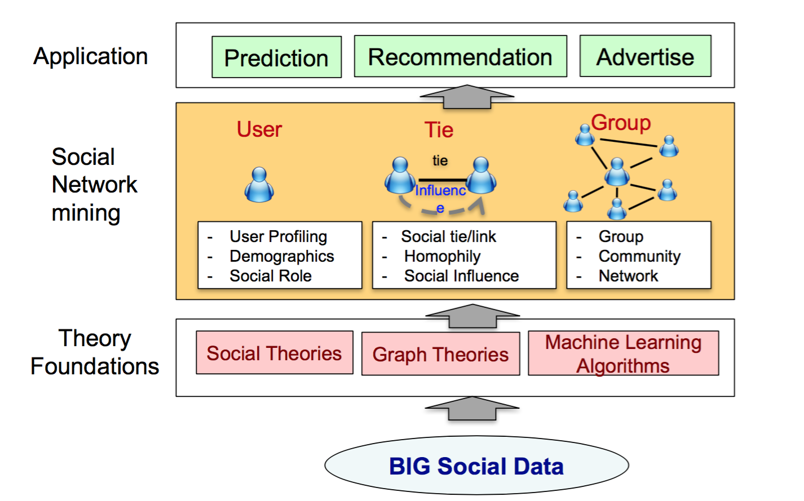
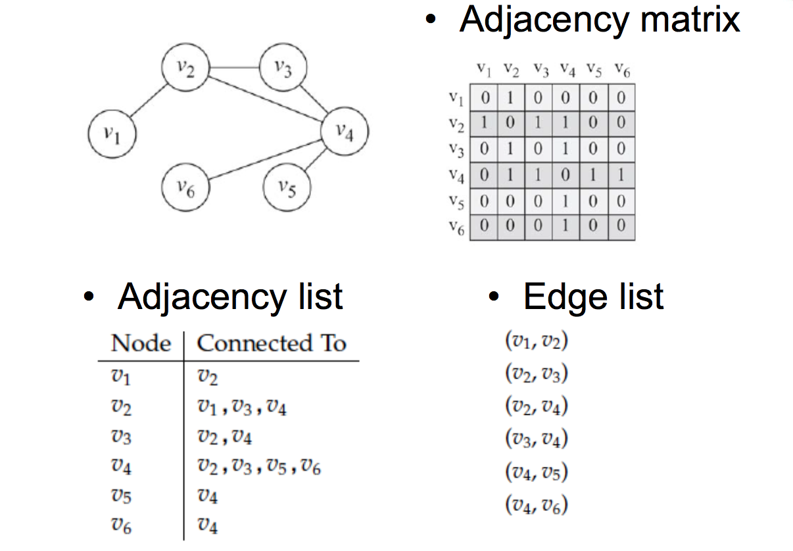

## 内容提纲
- 社会网络分析简介

- 社会网数据的基本概念
    - 关系类型
    - 网络类型
    - 网络表示方式
- 社会网数据的构成
    - 边数据
    - 点数据
- 可视化的目的与方式

## 社会网络分析简介：理解框架{#myImageP70}
 

## 社会网络分析简介：理论基础

Social/Graph theories

    – Two-step flow theory
    – Three degree of influence 
    – Social balance
    – Social status
  
Graph theories

    – Graph categories
    – Network measures
    – Network generation model
  
Deep learning algorithm

    – RNN
    – LSTM
    – Attention mechanism 
    – CNN

## 社会网络分析简介：数据获取{#myImageP70}

 

## 社会网络分析简介：呈现方式{#myImageP70}

 

## 基本概念：关系类型{#myImageP70}

 

## 基本概念：图类型{#myImageP70}

+ Directed/Undirected/Mixed graphs 

    – Directed edges: friend relationships
    – Undirected edges: follow relationships

+ Simple graphs

    – Only one edge could exist between any pair of nodes

+ Multigraphs

    – Multiple edges exist between two nodes: two users can be friends and, at the same time, colleagues, group members, or other relation

+ Weighted graphs

    – Weight: the number of links between two web sites
    
    – Signed graph, e.g.，A+edge(friend),a-edge(foe); A+edge(highersocialstatus),a-edge(lowersocialstatus)

## 网络的矩阵表示{#myImageP70}
单模网与双模网

 

## 网络的矩阵表示{#myImageP70}
对称网

 

## 网络的矩阵表示{#myImageP70}
有价网

 
 
 

## 网络的矩阵表示{#myImageP70}
附属网

 
 
 

## 网络的矩阵表示{#myImageP70}
有向网、表示方式2

 
 
 

## 网络的矩阵表示{#myImageP70}
所有社会网络内部结构都可以用邻接矩阵表示

 
 
 

## 数据结构{#myImageP70}
edgelist

 
 
 

## 数据结构：{#myImageP70}
nodelist

 
 
 
 
 

## 可视化 {#myImageP70}
 
 
 
 
 
## 可视化 {#myImageP70}

 

## 可视化 {#myImageP70}

 
