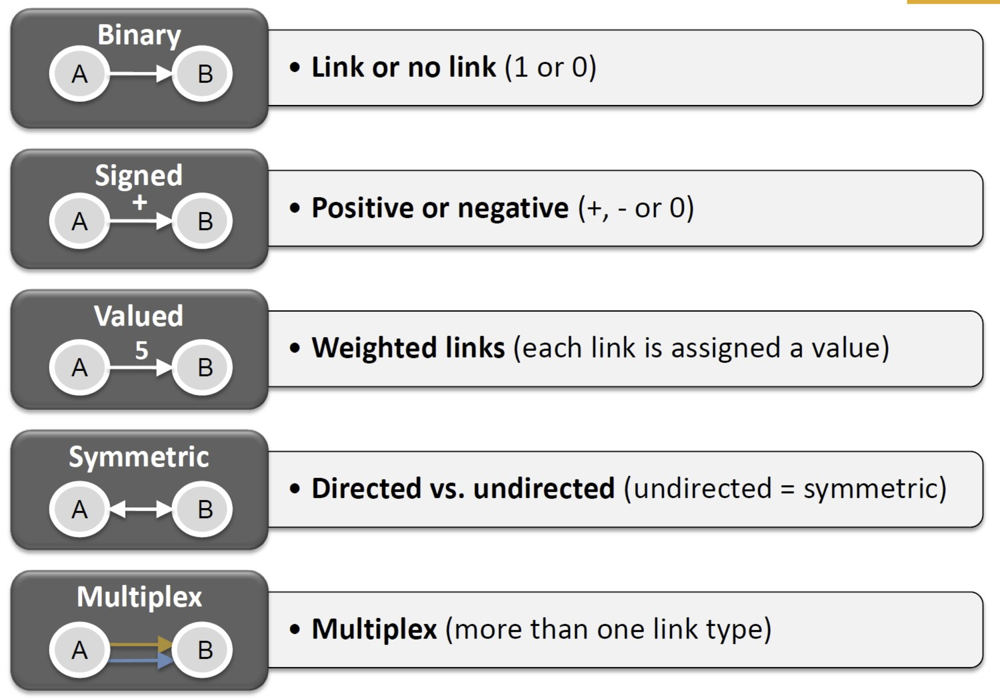
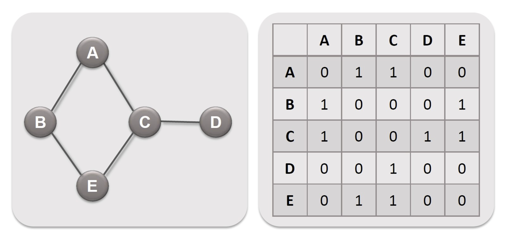
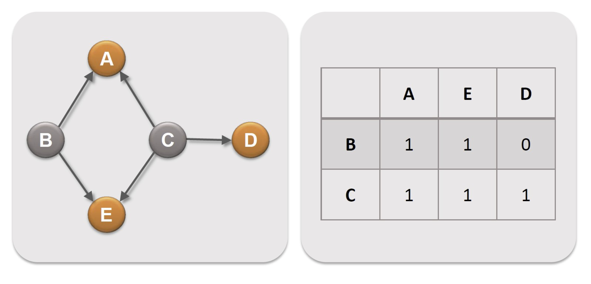
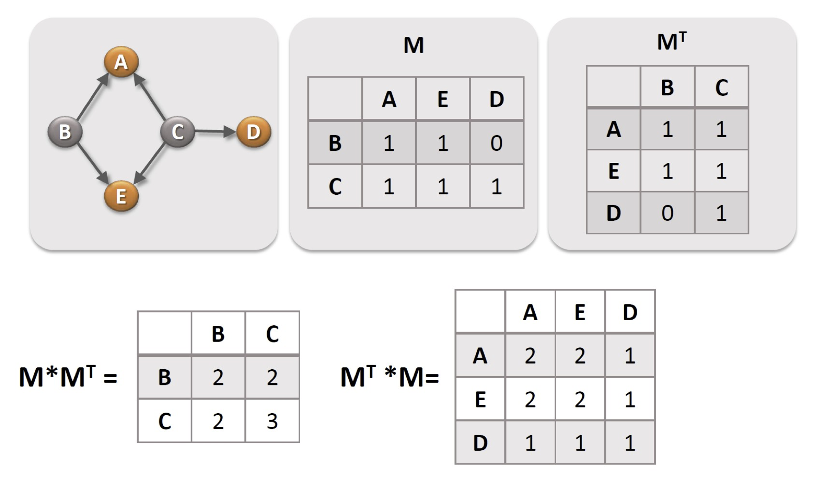
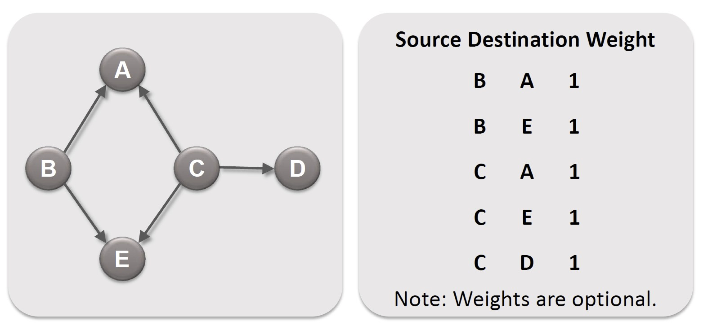
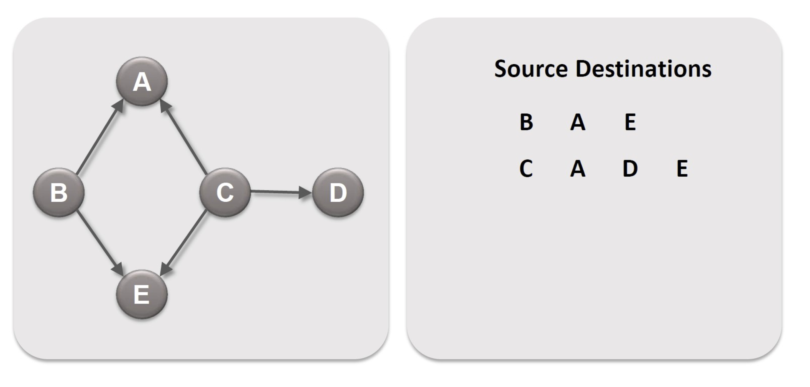
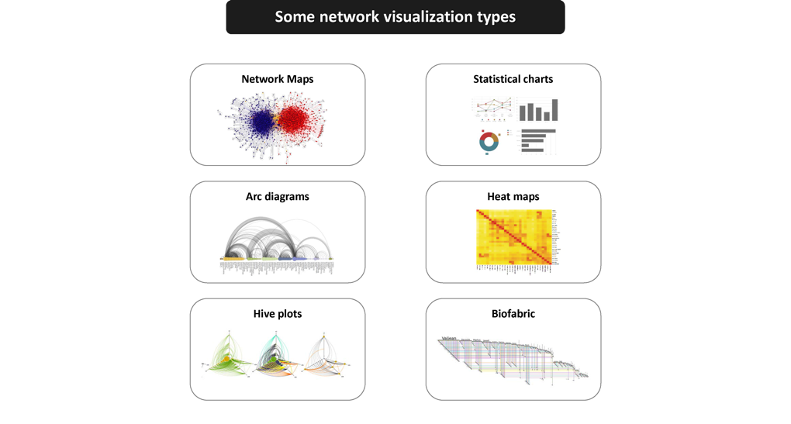
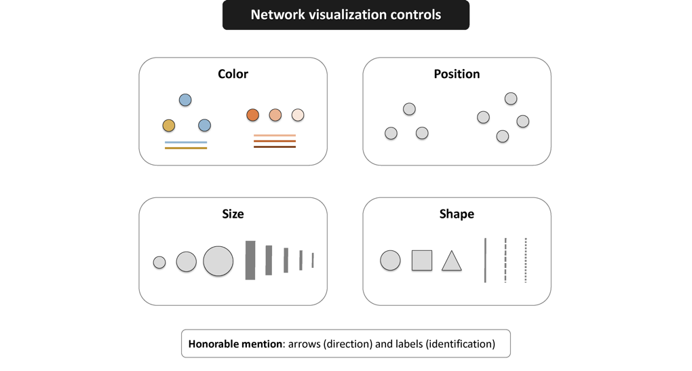

## 内容提纲

- 社会网数据的基本概念
    - 关系类型
    - 网络类型
    - 网络表示方式
- 社会网数据的构成
    - 边数据
    - 点数据
- 可视化的目的与方式

## 网络数据的获取方式{#myImagePage}

 

## 网络数据的结构{#myImagePage}
关系类型

 

## 网络数据的结构{#myImagePage0}
单模网与双模网

 

## 网络的矩阵表示{#myImagePage0}
有向网

## 网络的矩阵表示{#myImagePage0}
对称网

 

## 网络的矩阵表示{#myImagePage0}
有价网

 
 
 

## 网络的矩阵表示{#myImagePage0}
附属网

 
 
 

## 网络的矩阵表示{#myImagePage}
有向网、表示方式2

 
 
 

## 网络的矩阵表示{#myImagePage}
所有社会网络内部结构都可以用邻接矩阵表示

 
 
 

## 数据结构{#myImagePage0}
edgelist

 
 
 

## 数据结构：{#myImagePage0}
nodelist

 
 
 
 
 

## 可视化 {#myImagePage0}
 
 
 
 
 
## 可视化 {#myImagePage0}

 

## 可视化 {#myImagePage0}

 
