## 内容提纲

- 网络爬虫能做什么

- 网页结构与网络访问

    - 网页结构
    - 网络访问
        
- 网络数据抓取的基本流程

    - 获取网页
    - 解析网页
    
- 用R进行网络数据抓取的示例

- 用python进行网络数据抓取

## 网络爬虫能做什么: 目录索引与搜索引擎{#myImageP90}

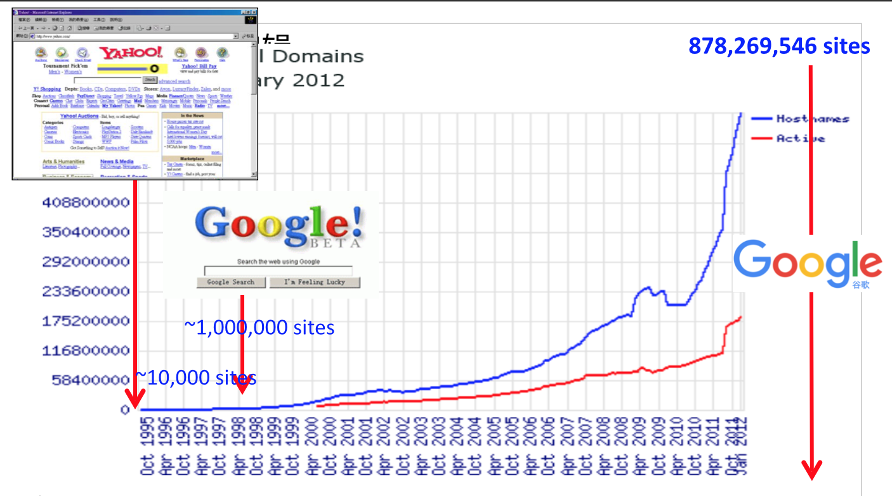 

## 网络爬虫能做什么: 搜索引擎原理

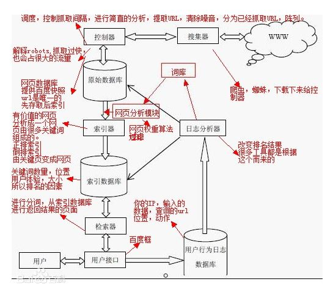 

## 网络爬虫能做什么: 分析引擎 {#myImageP90}
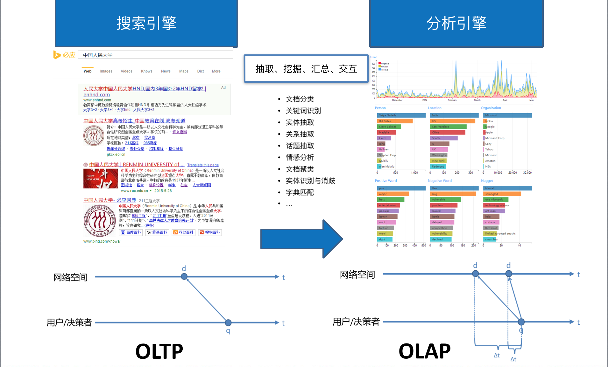 

## 网络爬虫能做什么: 分析引擎 {#myImageP90}

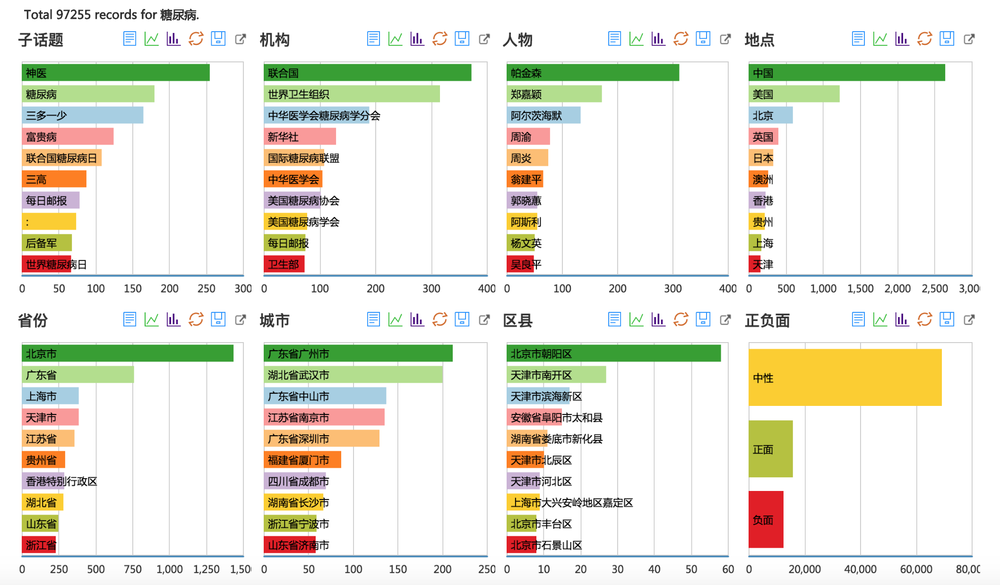 

## 网络爬虫能做什么: 小型爬虫 {#myImageP90}

- 通常局限在一定的网站、网页范围内

    - BBS、贴吧（陈华珊、Gary King）
    - 微博、人人网、知乎（黄荣贵）
    - 问政平台（孟天广、李锋）
    - 图片网站、街景（龙瀛）
    - 裁判文书网站
    
    …… 需找到相关网址的共性，进行遍历或抽样
    
- 通常需要进行深度的信息抽取、挖掘、分析

    - 整理成为矩阵数据或者进行文本挖掘
    - 分词、主题分析、情感分析、关联分析
    
    
# 网页结构

## 网页结构 {#myImageP70}

 - HTML   +     CSS   +  JavaScript
 - 结构    +     样式  +     功能
 - 房间设置  +   装修样式   +  电器

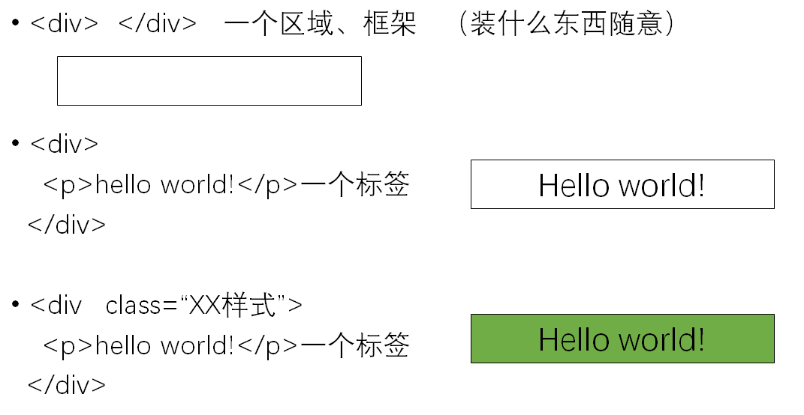 

## 网页结构:常用标签 {#myImageP90}

 

## 网页结构:常用标签 {#myImageP90}

XPath:  /body/h1

 

## 网页结构:常用标签 {#myImageP95}

[CSS](http://www.runoob.com/try/try.php?filename=trycss_font):  

 

## 网页结构:DOM {#myImageP70}

Document Object Model(DOM).中可以通过name、id、class、css Selector、xpath进行定位。
 
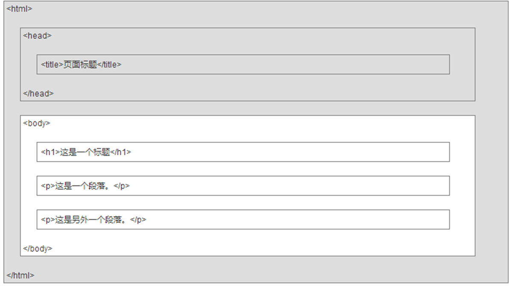 

## 网页结构：HTML示例

HTML 基础- 基础实例 http://www.runoob.com/html/html-basic.html

HTML 基础- CSS教程
http://www.runoob.com/html/html-css.html

HTML 教程 | 菜鸟教程  http://www.runoob.com/html/html-tutorial.html

## 网页结构：审查元素{#myImageP90}

 

# 网络访问

## 网络访问：请求过程{#myImageP90}
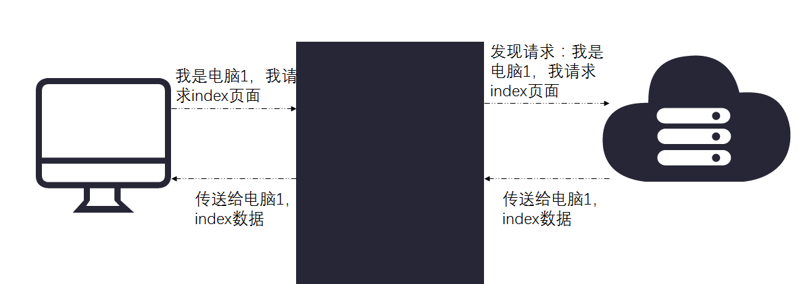 

## 网络访问：请求过程{#myImageP90}

**建立连接**：建立与URL(统一资源定位符,Uniform Resource Locators)或者IP地址如的连接.端口如80就像门。

URL样式：scheme://hostname:port/path?querystring#fragment；

URL实例：http://nbachina.qq.com/a/20170914/004815.htm

**发送请求**：向目标服务器发送一串文本，采用特定的协议（格式）。常见网络通信协议有HTTP、TCP、UDP 等。

注: HTTP全称是HyperText Transfer Protocal。即：超文本传输协议。HTTP是应用层协议，使用WEB浏览器浏览网页，浏览器和服务器之间就会通过HTTP协议进行数据的发送和接收。

## 网络访问：请求包 {#myImageP95}

请求字符串（16进制码——ASCII码）

 

图片来自：[Yang的博客](http://ohao.ren/2016/01/28/HTTP-Protocal/)

## 网络访问：请求包结构 {#myImageP90}

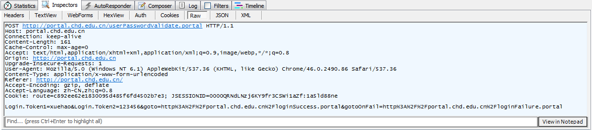 

请求包体的结构

 

## 网络访问：响应包 {#myImageP90}

响应包示例1

 

响应包结构

 

## 网络访问:示例2 {#myImageP95}

**请求包**（部分）：

GET /lidingruc/2017R HTTP/1.1  
Host: github.com  
Connection: keep-alive  
Cache-Control: max-age=0  
Upgrade-Insecure-Requests: 1  
User-Agent: Mozilla/5.0 (Macintosh; Intel Mac OS X 10_11_6) AppleWebKit/537.36 (KHTML, like Gecko) Chrome/63.0.3239.84 Safari/537.36

**响应包**（部分）：

HTTP/1.1 200 OK  
Server: GitHub.com  
Date: Tue, 19 Dec 2017 12:05:09 GMT  
Content-Type: text/html; charset=utf-8  
Transfer-Encoding: chunked  
Status: 200 OK  
Cache-Control: no-cache  
Vary: X-PJAX

## 网络访问:请求类型 {#myImageP90}

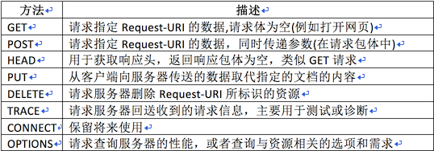 

## 网络访问:GET和POST 方法对比 {#myImageP90}

**GET方法**：参数是直接附带在URL中的，像这样：  
http://www.abc.com/?params1=val1&params2=val2

**POST方法**：参数是经过编码后放在HTTP包的请求体中的。编码方式有“x-www-form-urlencoded”和“form-data”。  
前者一般用来传输“key=value”键值对，如：user=123&pwd=456  
form-data可以传输二进制。在我们需要传输大文件，如图片时就需要使用form-data。

GET用于信息获取，同一个URL请求只会返回同一个结果。 
POST表示可能会修改服务器上资源的请求。 
GET请求被放在了URL中，POST请求的内容并不在URL中。 
HTTP协议中数据包均采用明文传输，通过抓包都很容易被看到。

## 网络访问:响应状态码 {#myImageP90}

1xx：指示信息–表示请求已接收，继续处理  
2xx：成功–表示请求已被成功接收、理解、接受  
3xx：重定向–要完成请求必须进行更进一步的操作  
4xx：客户端错误–请求有语法错误或请求无法实现  
5xx：服务器端错误–服务器未能实现合法的请求  

 

# 网络数据抓取

## 网络数据抓取流程{#myImageP30}

爬虫是一种利用代码模拟浏览器获取页面并根据HTML结构或正则表达式筛选获取有关信息的一种工具。

在R里面我们通常用Rcurl包或者httr包实现前一半的功能（模拟浏览器访问页面），用XML或者xml2包完成后一半功能（通过HTML树结构筛选提取信息）。

 - 获取网页——>解析网页——>提取信息
 
 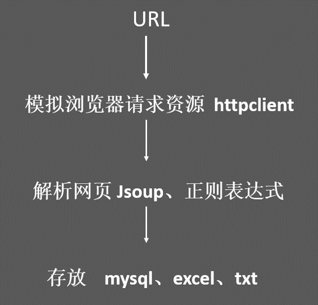 
 
##  获取网页的工具{#myImageP90}

+ 请求库（将HTML或XML文件弄到本地）：

     - RCurl: 旧,基于C的liburl 
     - httr： 新,短小精悍，类似于python的Request
     
 

##  解析网页的工具

+ 解析库（重建HTML或XML文件的层次结构）：

     - XML（以C语言为基础的libxml2库）
     
          + htmlParse（DOM风格的解析器）
          
     - xml2 ([handley在XML基础上修改的包](https://blog.rstudio.com/2015/04/21/xml2/))
     
          + 生成xml_node和xml_nodeset两类class
          

对于xml_nodeset，用[[]]来选出xml_node、或用[]选出xml_nodeset。[[只限单选，[可以多选。如class(xml_children(doc)[[1]])；class(xml_children(doc)[1])

对于xml_node，不能用[[或[；只能用xml_children()取xml_node，xml_nodeset取xml_nodeset。

 
##  提取网页信息的工具 

+ 提取库(提取节点、文本、属性及其属性值)：

       1. XML +XPath
       
           -  getNodeSet()或xpathSApply()
           
      1. xml2+XPath
      
           - xml_value()或xml_find_all()
           
      1. selectr+CSS（XML和xml2解析结果）
      
          可用SelectorGadget定位节点信息
  
        
## 请求与解析工具组合

**RCurl + XML**：较老的组合

**httr + rvest**：

Handley封装了httr、xml2。默认加载selectr、magrittr。rvest主要用于解析，请求功能不足。可以进行管道操作%>%。同时支持css/XPtah表达式。复杂请求最好用原生的请求库比如RCurl和httr。

- html_node(x, css, xpath)
- xml_node(x, css, xpath)

## 信息提取时定位节点方式

- XPath 
- CSS
- 正则表达式

web%>%html_nodes(".houseInfo")%>%html_text()

web%>%html_nodes("//h2")%>%html_text()

str_extract(example_text2, "sm[abc]ll")

## 信息提取1：XPath查找节点

1. “/”代表绝对路径。就是不可跳转的没有任何捷径的路径。

1. “//”代表相对路径。可随意跨越，不必严格按照节点层次和顺序遍历的路径。相对简洁的路径表达式。

1. “.”指代某路径本身。该符号专门用于对路径进行二次引用的需求，可理解为占位符，管道符号传参过程中处理左侧传入参数占位所用的特殊符号。

1. “*”指代任何内容。

1. “|”符号代表或条件，在正则中还是在函数逻辑符号中都是如此。

1. “@”：选择属性。

1. []符号。

Chrome插件SelectorGadget自动生成XPath表达式。

## 信息提取2：CSS标签节点

需要找到相关节点的CSS样式属性信息，如 下面的 class 类型，或者 id取值。

a href="#setup" aria-hidden="true" class="anchor" id="user-content-setup"

## 信息提取3：正则表达式字符匹配

更为通用、更加底层的文本信息提取工具

使用一个字符串来描述、匹配一系列某个语法规则的字符串。通过特定的字母、数字以及特殊符号的灵活组合即可完成对任意字符串的匹配进而提取。

基础文本处理函数 +  stringr包。

stringr包是Hadley Wickham 开发了一款专门进行文本处理的R包。它对基础的文本处理函数进行了扩展和整合，在一致性和易于理解性上都要优于基础函数。

示例：邮箱账户的正则表达式
[A-Za-z0-9\._+]+@[A-Za-z0-9]+\.(com|org|edu|net) 

正则表达式速查表
http://www.jb51.net/shouce/jquery1.82/regexp.html

在线测试正则表达式：
https://www.regexpal.com/

## 信息提取3：正则表达式+文本处理函数{#myImagePage60}

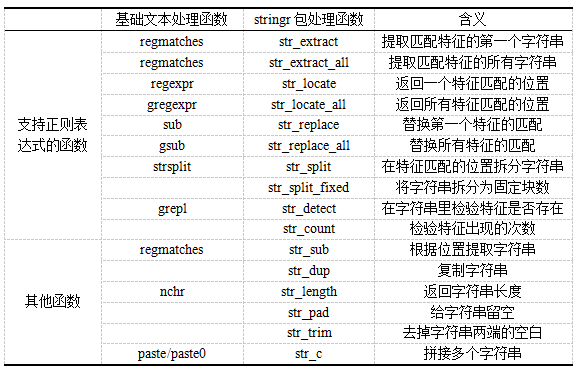 

## 信息提取：正则表达式{#myImageP90}

 

## 信息提取：正则表达式{#myImageP90}

 

#  网络爬虫示例：R代码

##  先讲一种不需要代码的信息获取

西安交通大学校友捐赠榜：

http://alumni.xjtu.edu.cn:9090/donation/namelist?pageNo=1&pageSize=200&billnum=&donateUserName=&orderWay=&donationid=0

## R代码示例：见code文件。

## 动态网页抓取

AJAX（引发动作实现网页修改）+XHR（异步通信加载HTML/XML和JSON数据）

AJAX，全称叫做异步JavaScript和XML（Asynchronous JavaScript and XML）。不同的浏览器有自己的AJAX实现组件，有了AJAX技术之后，无需对整个网页进行刷新了，局部更新既不占用宽带又可以提高加载速度有没有。比如知乎首页，想看新内容？不断把网页下拉自动加载就好。

JavaScript嵌入HTML并对之进行修改的三种改进方法：

1. 以HTML中的 script标签为固定位置进行代码内嵌； 
2. 对script元素中的src属性路径引用一个存放外部的JavaScript代码文件； 
3. JavaScript代码直接出现在特定HTML元素属性里，也叫事件处理器。

## 动态网页抓取：查看真实网页 {#myImageP90}

NETWORK + XHR

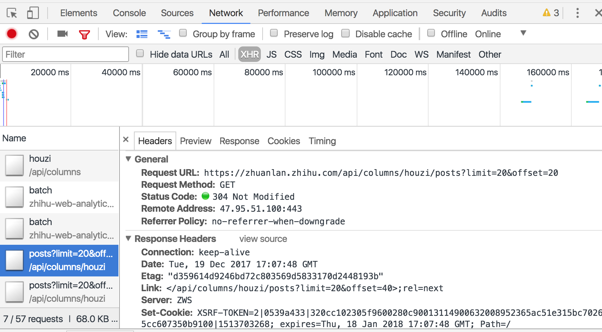 

##  动态网页抓取

 **R工具** 

    - RSelenium（推荐）
    - Rwebdriver(不很成熟)
    - seleniumpipes(结合RSelenium更高效)
    - rdom（高级封装，灵活性不够）
    - Rcrawler（支持多进程）
    - webshot（专门用于动态网页截图）

 **要求**

    1. 本地有selenium服务器并添加系统路径；
    2. 本地有plantomjs浏览器并添加系统路径；
    3. 安装了RSelenium包。

## 模拟登陆与复杂翻页

参考：http://www.xueqing.tv/lesson/329

## 批量化提取

见示例

## 反爬虫问题

  - 尊重、法律
  - 禁止同一IP段时间频繁请求
  
      + 放慢速度，增加IP池
      + 自动识别验证码，做到比机器人更聪明
      + 选择不同的通道（手机通道可能更简单）
      
  - 隐藏或动态变化真实网址
      + 更新、复杂化爬虫设定
      + 更深入的研究真实网址
      + 进行浏览器模拟（慢，但是人能看到的也能爬到）
## python 爬虫

- 关键在于了解python的基本工作环境
- python语言比较容易学习

- 示范python的操作

参考1python安装与环境：https://www.crifan.com/files/doc/docbook/python_beginner_tutorial/release/htmls/ch04_python_dev_env.html#how_dev_python_in_window

参考2中文详细：http://cw.hubwiz.com/card/c/570dce425fd193d76fcc723d/1/1/1/
参考3英文简洁：http://www.dataschool.io/python-web-scraping-of-president-trumps-lies/

