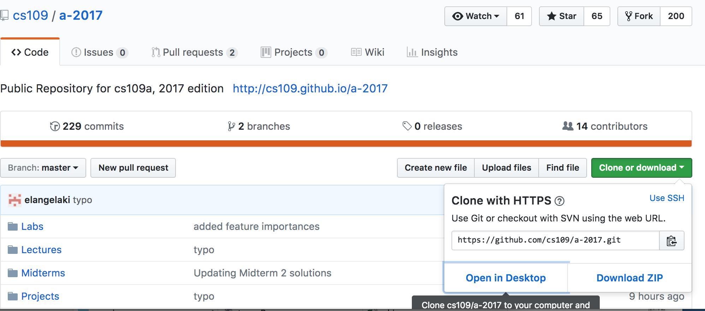
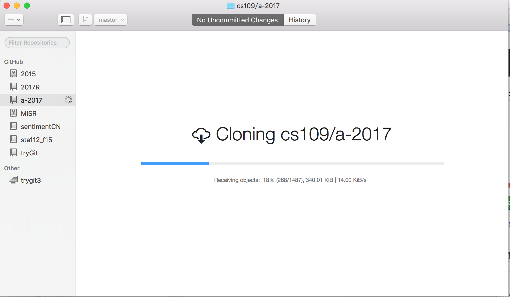
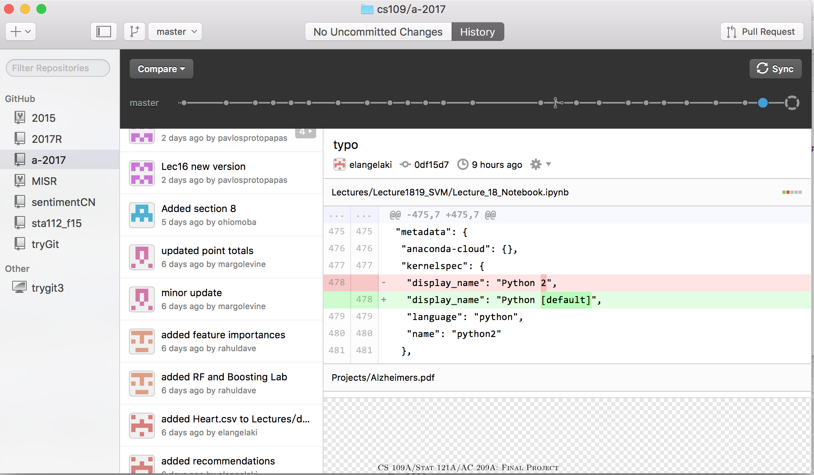
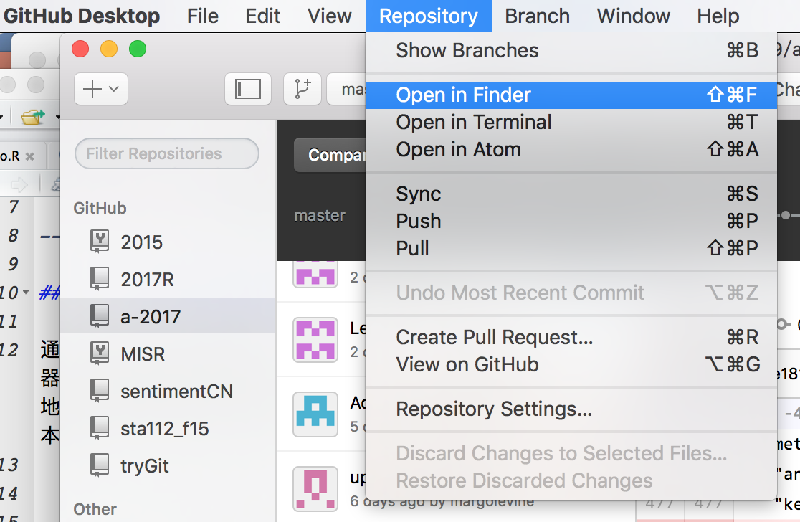
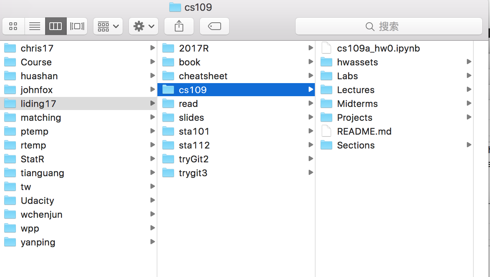
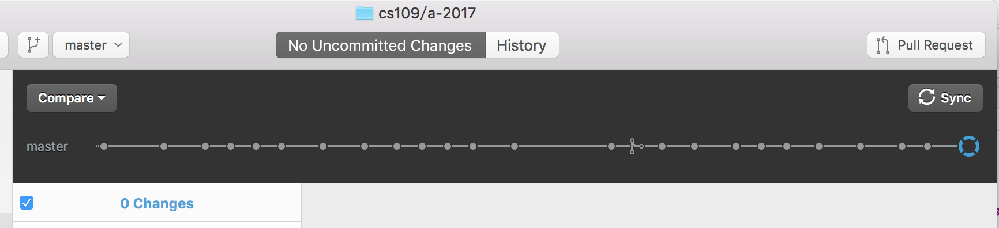
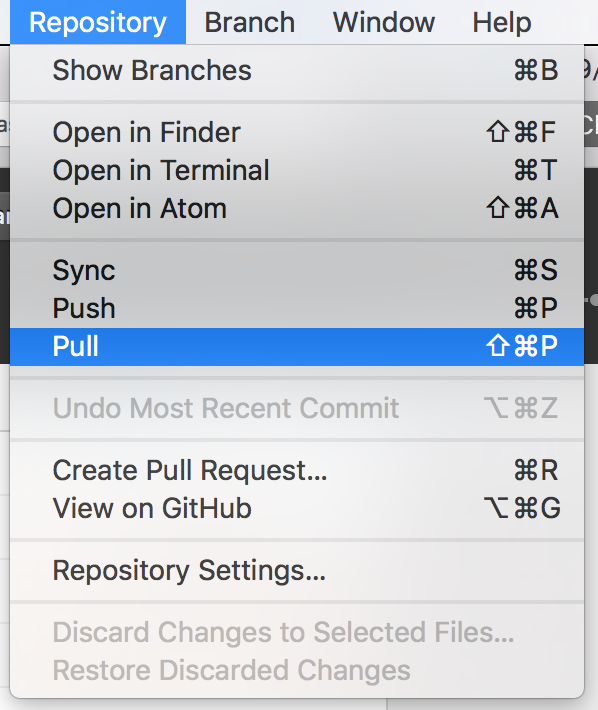
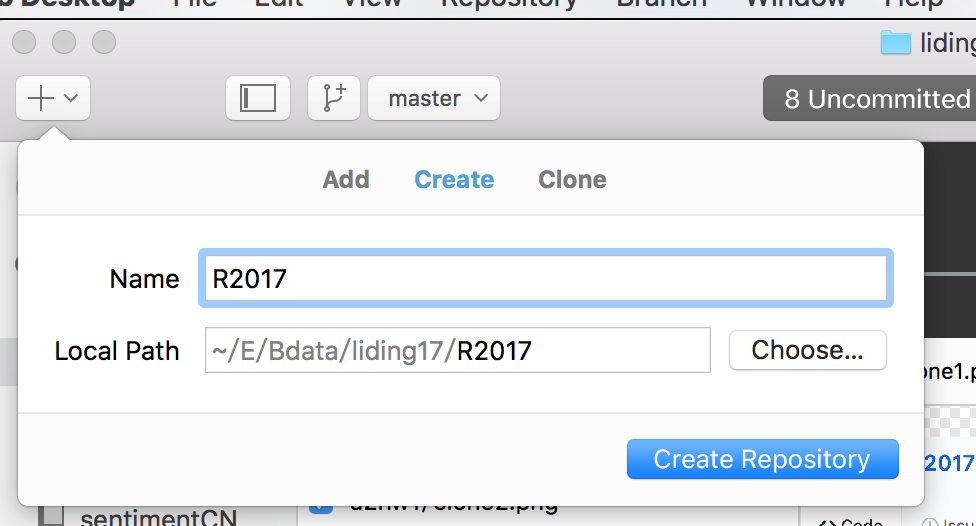
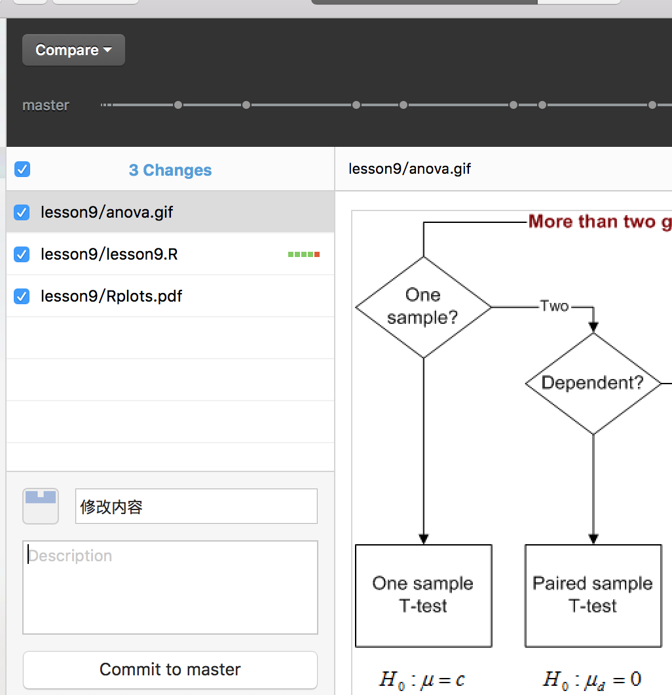

## 一、github的使用练习

通过注册github账号，我们可以将自己撰写的程序发布到远端服务器上，与其他人共享。下载github的桌面端软件后，我们可以方便地复制服务器上的他人的版本库，进行更新。也可以管理自己的版本库。

### 1.1、注册github账号，克隆一个版本库、更新版本库。

注册好账号，安装桌面端后，在桌面端登录github。
在github网页上找到要克隆的版本库。点击clone or download，选择open in desktop，直接用github桌面程序打开。


进入复制状态,等待复制结束。


复制完成之后，展示了版本库更新的历史。


要查看复制下来的文件，请通过菜单repository中的open in finder或open in fold看看文件。


即可查看本地文件。


如果远端版本库更新了，可以通过右上角同步快捷按钮更新远端的更新到本地电脑中的文件夹。


或者Reposity菜单中的pull也可以

### 1.2、创建一个版本库，本地添加文件，同步版本库。

如果你想将课上基于老师的课件所做的笔记保存到自己的版本库中，并能与其他人在github上分享，你可以将这些文件放在你自己的版本库文件夹中。前提是你需要创建一个版本库。

然后，你将前面更新到本地的最新文件拷贝到这个本地文件夹中，进行修改之后，可以发布到自己的github账号中。

创建版本库可以file-new repository创建，也可以通过左上角的加号快捷键创建。选择合适的文件夹名（同时也是版本名）


创建好之后，你可以在本地文件夹系统中找到这个文件夹。然后将老师的课件拷贝到里面。上课时，你使用R的时候，打开这个文件里面的文件，并添加笔记等等信息即可。完成之后，你可以将相关的修改发布（添加修改描述后commit）到自己的github上。


当然，你可以可以不发布这些更改，甚至不创建自己的版本库，只是将老师的文件复制到自己的另一个文件夹进行本地使用和修改。

## 二、读入数据并进行简单描述分析

### 2.1 读入数据进行预处理

haven包默认导入spss和stata数据后,变量标签存在*变量*的的label属性当中,取值标签在labels属性当中。

```{r}
library(haven)
library(tidyverse)
setwd("/Users/liding/E/Bdata/liding17/2017R/lesson9/")
cgss2013 <- read_spss("cgss2013.sav") 
# cgss2013 <- read_stata("/Users/liding/DATA/CGSS/2003-2013/2013/cgss2013_14.dta") # 或者stata数据

#替换用户定义缺失值为系统缺失值
cgss2013[cgss2013==-1] <- NA
cgss2013[cgss2013==-2] <- NA
cgss2013[cgss2013==-3] <- NA
cgss2013[cgss2013==9999997] <- NA
cgss2013[cgss2013==9999998] <- NA
cgss2013[cgss2013==9999999] <- NA

# 删除没有用到的取值标签
cgss2013 <- sjlabelled::drop_labels(cgss2013) 

#将还有取值标签的变量转为因子，无取值标签的变量仍然为labelled类型
cgss2013 <- sjmisc::to_label(cgss2013) 

#将剩余的labelled变量，都转化为普通数值变量
w <- which(sapply(cgss2013, class) == 'labelled')
cgss2013[w]<- lapply(cgss2013[w], function(x) as.numeric(as.character(x)))

```
### 2.2 数据分析

进行简单数据描述、作图
```{r}
dim(cgss2013)
table(cgss2013$a10)
sjPlot::sjp.setTheme(theme.font ='STXihei' )
cgss2013 %>%
  select(a10) %>% sjPlot::sjplot(fun="frq")
```

可以看到CGSS2013共11438个案例，722个变量。其中共产党员1161人。

如果使用ggplot作图，命令和结果如下：
```{r}
library(ggplot2)
ggplot(data=cgss2013)+
  geom_bar(aes(x=a10)) +
  geom_text(stat='count',aes(x=a10,label=..count..),vjust=-1)
```

展示百分比构成的方式
```{r}
ggplot(cgss2013, aes(x = a10)) +  
        geom_bar(aes(y = (..count..)/sum(..count..))) + 
 geom_text(aes(y = ((..count..)/sum(..count..)), label = scales::percent((..count..)/sum(..count..))), stat = "count", vjust = -0.25) +
  scale_y_continuous(labels = scales::percent) +
  labs(title = "政治面貌百分比构成", y = "百分比", x = "政治面貌")

```

汇总数据之后再进行作图的方式，删除缺失值。
```{r}
d2 <- cgss2013 %>% 
  filter(is.na(a10)==FALSE) %>%
  group_by(a10) %>%
  summarise(count=n()) %>% 
  mutate(perc=count/sum(count))

ggplot(d2, aes(x = factor(a10), y = perc*100)) +
  geom_bar(stat="identity", width = 0.7) +
  geom_text(aes(y =  perc*100, label =sprintf("%0.1f", round(perc*100, digits = 1))), vjust = -0.25)+
  theme_minimal(base_size = 14,base_family = "STXihei")+
  labs(title = "政治面貌百分比构成", y = "百分比", x = "政治面貌")
```

